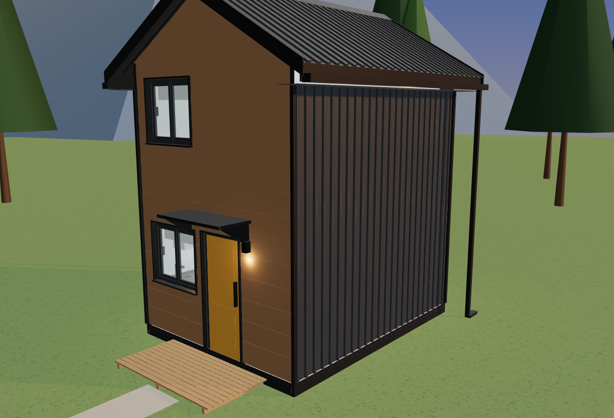

# Casa Bariloche: vivienda de renta de 2 plantas (etapa 1)

Anteproyecto completo de una casa de 36 m² cubiertos para 1 o 2 personas, en construcción en seco (entramado de madera). Todo sale de un **único modelo paramétrico** en JavaScript: modelo 3D, planos, cómputo de materiales, despiece de placas y lista de cortes de madera.



## Cómo verlo

Abrí **`dist/casa-bariloche.html`** en cualquier navegador. Es un único archivo, sin instalar nada y sin conexión. Tiene cinco pestañas:

| Pestaña | Qué tiene |
|---|---|
| **Modelo 3D** | Vistas predefinidas (exterior, pared de servicios, interior, plantas cortadas, instalaciones con rayos X, estructura, despiece de OSB y de yeso, escalera, baño), 22 capas que se prenden y apagan, cortes horizontales y verticales, modo día, atardecer y noche, y descarga de imagen. Al pasar el mouse sobre cualquier pieza (montante, placa, caño, caja eléctrica, mueble) se ve su nombre y material; con un clic, el detalle. |
| **Planos** | Plantas de arquitectura con amoblamiento y cotas, fachadas y cortes, eléctrico de PB y PA con planilla de cajas, unifilar, sanitaria, gas, pared de servicios, fundación con pases, entrepiso, techo y entramado de cada muro. Todos se descargan en SVG. |
| **Cómputo** | 111 ítems calculados desde el modelo, marcados como DURABLE, ECONÓMICO o ESTÁNDAR. Se pueden cargar precios unitarios para obtener el total, y descargar el CSV. |
| **Despiece** | Cada placa de yeso, cementicia y OSB tiene un código, una posición (mapa por cara) y un plan de corte optimizado. Incluye la lista de compra de maderas en largos comerciales, con los cortes de cada barra, y el pedido de chapas a medida. |
| **Memoria** | Decisiones del proyecto: seco contra mampostería, techo sin entretecho, cálculo del calefactor, criterio de materiales, colores, normativa y preguntas para la próxima etapa. |

Los planos y el cómputo también están exportados en `docs/` para verlos sin abrir la app:

- `docs/planos/*.svg`: 21 planos.
- `docs/computo.md` y `docs/computo.csv`.
- `docs/despiece/*.html`: posición y plan de corte de cada placa, por material.
- `docs/img/*.png`: capturas del 3D.
- `docs/memoria.md`: memoria descriptiva.

## Números clave

| | |
|---|---|
| Exterior | 4,80 x 3,80 m, 2 plantas, techo a dos aguas a 30° |
| Superficie | 36,4 m² cubiertos · 26,5 m² útiles |
| Placas | 48 de yeso (41 estándar + 7 RH) · 4 cementicias · 39 de OSB (33 de 11 mm + 6 de 18 mm) |
| Calefacción | Tiro balanceado de 3.000 kcal/h. La pérdida calculada es de ≈ 2,6 kW con −12 °C afuera |
| Instalación eléctrica | 4 circuitos, 25 cajas rectangulares y 6 octogonales |

## Estructura del código

```
src/specs.js     catálogo de materiales (nombre, color, criterio durable/económico)
src/geom.js      primitivas, despiece de placas sobre caras y empaquetado (placas y barras)
src/model.js     EL MODELO: parámetros, estructura, envolvente, aberturas, escalera,
                 cocina, baño, muebles e instalaciones (agua, desagües, gas, electricidad)
src/takeoff.js   cómputo de materiales
src/plans.js     planos SVG
src/viewer.js    visor 3D (three.js)
src/app.js       interfaz (pestañas)
docs/memoria.md  memoria (se compila dentro de la app)
tools/build.mjs  arma dist/casa-bariloche.html y exporta docs/
tools/shots.mjs  capturas del 3D con Chromium headless
```

Para cambiar algo (una medida, una abertura, la posición de una caja) se edita `src/model.js` y se vuelve a generar todo:

```
npm install
npm run build                     # dist/ + docs/planos + docs/computo
node tools/shots.mjs docs/img     # capturas (opcional)
```
