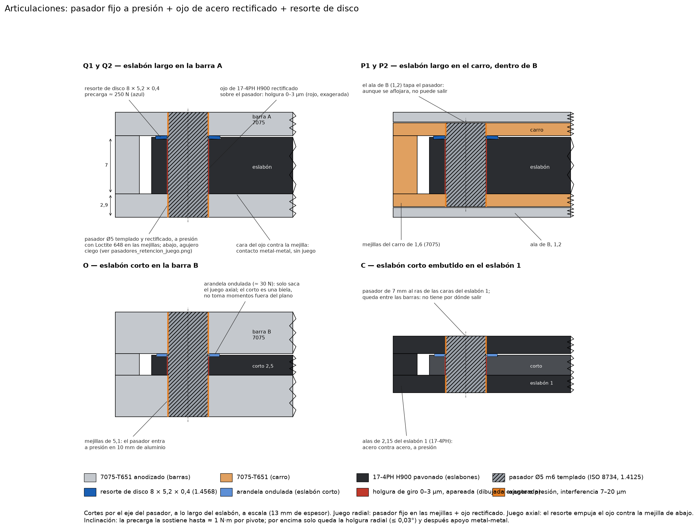
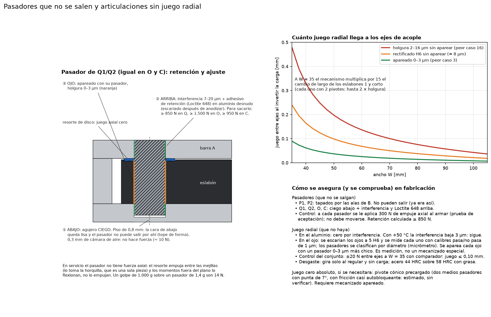
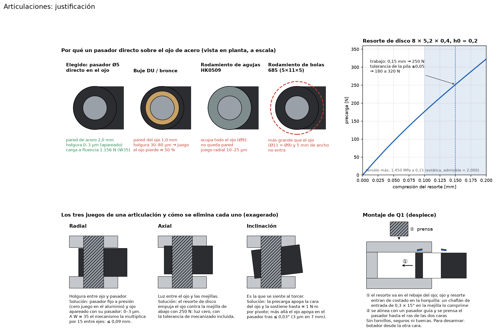
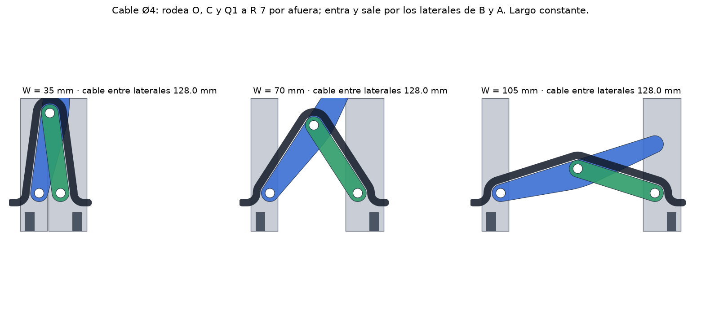

# Análisis de resistencia: eslabón regulable v10

Cuánta fuerza aguanta el eslabón entre sus ejes de acople y qué pieza falla primero, en todo el rango de ancho de 35 a 105 mm. El cálculo lo hace `analisis.py` sobre la geometría real del CAD (`eslabon.py`). Los resultados quedan en `salida/capacidad.json`.

> **La traba del carro no está definida todavía.** El cálculo supone una traba ideal **en el medio del carro, entre P1 y P2**, contra la columna de B, e informa la fuerza que tiene que aguantar. Esa ubicación es un requisito para la traba: en una punta del carro, el carro pasa a limitar (420 N a W = 35).

## Resultado

Carga entre ejes hasta la primera fluencia, sin coeficiente de seguridad. Es el mínimo entre tracción y compresión, que en este diseño dan igual.

| Ancho W [mm] | Carga a fluencia [N] | Carga de trabajo estática, ÷ 1,5 [N] | Limita | Flexibilidad entre ejes [mm/kN] | Fuerza sobre la traba [N por N] |
|---:|---:|---:|---|---:|---:|
| 35 | 738 | 492 | flexión de la barra A | 6,7 | 7,48 |
| 45 | 1.007 | 671 | flexión de la barra A | 3,0 | 3,88 |
| 50 | 1.095 | 730 | flexión de la barra A | 2,4 | 3,09 |
| 60 | 1.223 | 816 | flexión de la barra A | 1,7 | 2,13 |
| 70 | 1.317 | 878 | flexión de la barra A | 1,4 | 1,55 |
| 90 | 1.459 | 973 | flexión de la barra A | 0,9 | 0,81 |
| 105 | 1.572 | 1.048 | flexión de la barra A | 0,7 | 0,32 |

La barra A limita en todo el rango. Las articulaciones quedan por encima: a W = 35 la más débil llega a fluencia con 1.156 N entre ejes, un 57 % más que la barra A (ver «Articulaciones»).

Comparación:

| | W = 35 | W = 50 | W = 70 | W = 105 |
|---|---:|---:|---:|---:|
| v1 (traba por fricción) | ≈ 25 N | – | ≈ 100 N | – |
| v2 | 605 N | 1.165 N | 1.284 N | 1.409 N |
| v3 | 762 N | 1.227 N | 1.521 N | 1.634 N |
| v4 (lateral semicilíndrico) | 597 N* | 981 N* | 1.126 N* | 1.244 N* |
| v5 (riel en C, corto embutido, eslabón 1 engrosado) | 673 N | 1.004 N | 1.156 N | 1.256 N |
| v6 (eslabones largos iguales y planos, corto de 2,5) | 547 N | 804 N | 1.083 N | 1.256 N |
| v7 (cable Ø4 oculto de largo fijo) | 480 N | 716 N | 955 N | 1.152 N |
| v8 (eslabones en 17-4PH) | 578 N | 833 N | 984 N | 1.152 N |
| v9 (barra A de 175 mm) | 665 N | 972 N | 1.160 N | 1.372 N |
| v9 (barra A de 165 mm) | 716 N | 1.093 N | 1.317 N | 1.572 N |
| **v10 (articulaciones reforzadas, eslabones H900)** | **738 N** | **1.095 N** | **1.317 N** | **1.572 N** |

\* Las cifras de la v4 y anteriores se calcularon con un error en la lectura del contorno de las piezas (`contorno_capa` armaba el polígono con tramos en orden inconsistente). Afectaba sobre todo las mejillas del carro y de las barras. Está corregido en la v5; las versiones anteriores no se recalcularon.

Para cargas cíclicas (vibración, ciclos de arranque y parada), usá **menos de un tercio** de la carga a fluencia. El 7075 tiene baja resistencia a la fatiga con concentradores, y los agujeros de los pernos en ligamentos finos lo son.

## Qué cambió en la v10: lateral R 5 y articulaciones reforzadas

- **Lateral exterior.** El semicilindro R 6,5 pasa a un arco R 5 centrado en el eje de acople, de ±25° respecto del plano medio, con caras planas arriba y abajo y un chaflán de 0,5 mm en el encuentro. Recupera material en la nariz de las dos barras.
- **Eslabones en 17-4PH H900** (SUS630 envejecido a 482 °C, la condición estándar de mayor resistencia): Sy = 1.170 MPa, Su = 1.310 MPa. Es un tratamiento de catálogo, sin mecanizado especial; hay que pedirlo así en Rapid Direct, con certificado. Se mecaniza en condición A (solubilizado) y se envejece después: el cambio dimensional es de −0,05 %, unos 0,04 mm en 85 mm entre centros, dentro del juego. El pavonado va después del envejecido.
- **Alas de B de 1,2 mm** (antes 1,5). Las mejillas del carro pasan de 1,3 a 1,6 mm: la tracción neta en P2 sube de 948 a 1.167 N a W = 35. La barra B baja de 1.478 a 1.257 N, todavía por encima de la barra A.
- **Resultado:** ninguna articulación limita. A W = 35 los ojos del eslabón corto pasan de 716 a 1.156 N y la capacidad la fija la barra A (738 N). Verificado sin choques entre piezas ni con el cable, de W = 35 a 105.

## Articulaciones

Seis pivotes Ø5: Q1 y Q2 en la barra A, P1 y P2 en el carro, O en la barra B y C en el eslabón 1. Todos trabajan en doble corte: un ojo entre dos mejillas.

**Fuerza en cada pivote con la carga a fluencia de la estructura** (la del eslabón corto pasa por O y por C):

| W [mm] | Carga entre ejes [N] | Q1 [N] | Q2 y P2 [N] | O y C [N] | Corte en el pasador [MPa] |
|---:|---:|---:|---:|---:|---:|
| 35 | 738 | 4.731 | 4.772 | 5.573 | 142 |
| 50 | 1.095 | 2.896 | 3.040 | 3.550 | 90 |
| 70 | 1.317 | 1.755 | 2.077 | 2.426 | 62 |
| 105 | 1.572 | 484 | 1.412 | 1.650 | 42 |

Los pivotes ven hasta 7,5 veces la carga entre ejes a W = 35. Margen de cada articulación sobre la carga que rompe la estructura (barra A), a W = 35:

| Articulación | Modo que manda | Carga entre ejes a fluencia [N] | Margen |
|---|---|---:|---:|
| O y C (eslabón corto, 2,5 mm) | desgarro del ojo | 1.156 | 1,57 |
| P2 (carro) | tracción neta de la mejilla de 1,6 mm | 1.167 | 1,58 |
| O, Q1, Q2 | flexión del pasador | 1.696 | 2,30 |
| P2 | flexión del pasador | 2.150 | 2,91 |
| C | aplastamiento de las alas del eslabón 1 | 3.022 | 4,09 |
| O y C | corte doble del pasador | 3.060 | 4,15 |
| Q1, Q2 (barra A) | tracción neta de la mejilla | 3.356 | 4,55 |

A W = 50 la más débil queda a 2.690 N (margen 2,5) y a W = 70 a 4.736 N (margen 3,6).

### Cómo es la articulación

Tres piezas por pivote, sin tornillos ni seguros:

1. **Pasador fijo.** Ø5 m6 templado y rectificado (ISO 8734 tipo A, inoxidable martensítico 1.4125, 550 a 650 HV), **a presión en las dos mejillas** y al ras de las dos caras. No gira contra el aluminio, así que el agujero blando no se gasta, y queda empotrado en los dos extremos.
2. **Ojo que gira sobre el pasador.** El ojo es del mismo eslabón de 17-4PH H900 (≈ 44 HRC) se escaria a Ø5 H6 y se **aparea** con un pasador medido: holgura de 0 a 3 µm (ver «Que los pasadores no se salgan y que no haya juego radial»). Acero duro contra acero más duro (58 HRC), con grasa de MoS2.
3. **Resorte de disco (Belleville) 8 × 5,2 × 0,4, h0 = 0,2**, en acero inoxidable para resortes (1.4568). Va en un rebaje de 0,25 mm de la cara de arriba del ojo y empuja el ojo contra la mejilla de abajo con unos 250 N. Lo usan Q1, Q2, P1 y P2. En O y C (eslabón corto de 2,5 mm) va una arandela ondulada liviana (≈ 30 N): el corto es una biela que no toma momentos fuera del plano, y un rebaje de 0,25 mm en una pieza de 2,5 le sacaría un 10 % a los ojos que hoy son los más débiles.

**Ajustes:**

| Lugar | Medida | Resultado |
|---|---|---|
| Pasador | Ø5 m6 (+0,004/+0,012), de catálogo | – |
| Agujero en las mejillas (7075) | Ø5 −0,008/−0,003, **escariado después de anodizar**; abajo, ciego (piso de 0,8 y 0,3 de cámara de aire) | interferencia 7 a 20 µm + Loctite 648 |
| Agujero del ojo (17-4PH H900) | Ø5 H6, escariado después del envejecido y del pavonado; medido con calibres de 1 µm | apareado con un pasador clasificado: holgura 0 a 3 µm |
| Pila axial: luz de la horquilla − espesor del ojo − (rebaje) | 0,45 ± 0,05 mm de alojamiento del resorte | resorte comprimido 0,15 ± 0,05 → 180 a 320 N |

Interferencia de 20 µm en la mejilla más fina (carro, 1,6 mm, anillo de Ø9): presión de 116 MPa y 220 MPa de tensión tangencial en el borde del agujero. En la barra A, 190 MPa. Hace falta 150 a 440 N para sacar el pasador por cada mejilla del carro y 400 a 1.140 N en la barra A. El resorte no carga el pasador en sentido axial: empuja entre las dos mejillas, y esa fuerza la toma el cuerpo de la horquilla, que es de una sola pieza.

### Que los pasadores no se salgan y que no haya juego radial

**Pasadores.** En servicio no tienen fuerza axial. El resorte empuja entre las dos mejillas y esa fuerza la toma la horquilla, que es de una sola pieza. Los momentos fuera del plano flexionan el pasador, no lo empujan. Igual se retienen con margen:

| Pivote | Retención | Para sacarlo |
|---|---|---:|
| P1, P2 | Las alas de B tapan las dos puntas: no pueden salir. | – |
| Q1, Q2 | Agujero **ciego** en la mejilla de abajo (tope de forma); arriba, interferencia 7 a 20 µm + Loctite 648 en aluminio desnudo. | ≥ 850 N |
| O | Ídem en la barra B (mejilla de 5,15). | ≥ 1.500 N |
| C | Ídem en las alas del eslabón 1 (acero contra acero, interferencia 4 a 10 µm). | ≥ 950 N |

- El agujero ciego deja el piso de 0,8 mm y 0,3 mm de cámara de aire. El aire comprimido empuja unos 10 N: no importa. Así la cara de abajo queda lisa, sin pasadores a la vista.
- Al armar, a cada pasador se le aplica un empuje axial de 300 N como prueba de aceptación.
- Calentar a +50 °C le saca 3 µm de interferencia al aluminio: sigue apretado.
- En el agujero ciego, el apoyo del pasador en la mejilla de abajo baja a 1,8 mm (Q) y 1,25 mm (C). Lo que queda debajo es material macizo: el aplastamiento sigue con margen ≥ 3.

**Juego radial.** En el aluminio es cero por la interferencia. En el ojo depende de la holgura. **A anchos chicos el mecanismo la multiplica:** con la traba fija, el cambio de largo efectivo del eslabón 1 y del corto se ve 7,4 y 7,5 veces en la distancia entre ejes. Cada uno tiene dos pivotes, así que al invertir la carga (tracción ↔ compresión):

| Holgura en cada ojo | W = 35 | W = 50 | W = 70 | W = 105 |
|---|---:|---:|---:|---:|
| 16 µm (rectificado sin aparear, peor caso) | 0,48 mm | 0,20 mm | 0,10 mm | 0,04 mm |
| 8 µm (H6 sin aparear) | 0,24 mm | 0,10 mm | 0,05 mm | 0,02 mm |
| **3 µm (apareado)** | **0,09 mm** | **0,04 mm** | **0,02 mm** | **0,01 mm** |

Por eso el ojo se **aparea**:

1. Se escarian los ojos a 5 H6 y se mide cada uno con calibres pasa/no pasa de 1 µm.
2. Los pasadores (m6, banda de 8 µm) se clasifican con un micrómetro.
3. Cada ojo va con un pasador entre 0 y 3 µm más chico.

Es medición y clasificación, no un mecanizado especial. Para comparar: a W = 35 la elasticidad del conjunto es de 6,7 mm/kN, así que 0,09 mm equivalen a la deformación con 13 N.

- **Control del conjunto armado:** ±20 N entre ejes a W = 35, con comparador. El juego al invertir debe ser ≤ 0,10 mm.
- **Desgaste:** las articulaciones giran solo al regular y sin carga, acero de 44 HRC sobre 58 HRC con grasa. No se espera que la holgura crezca.
- **Juego cero absoluto, si se necesitara:** pivote cónico precargado, con dos medios pasadores de punta a 7°. Con μ ≈ 0,1 el cono queda casi autobloqueado y el resorte lo mantiene asentado aunque haya carga. Es una estimación sin verificar y requiere mecanizado apareado de conos.
- **El carro tiene la misma amplificación:** cada 0,01 mm de juego del carro en el riel (o en la traba) son 0,075 mm entre ejes a W = 35. La traba tiene que apretar el carro sin juego.

### Justificación

**Por qué pasador directo y no un buje o un rodamiento.** El ojo tiene R 4,5 porque es lo máximo que entra entre las horquillas. Un buje de bronce o DU (5 × 7) deja 1 mm de pared en el ojo y tiene 30 a 80 µm de holgura. Un rodamiento de agujas HK0509 ocupa todo el ojo. Uno de bolas 685 (Ø11 × 5) directamente no entra. Además, las articulaciones solo giran al regular, sin carga, así que no hace falta un rodamiento. La carga llega con el mecanismo trabado y quieto: es un contacto estático, y para eso el acero templado directo es lo más fuerte que entra en el espacio. La presión media en los ojos de Q y P es de 141 MPa a la carga máxima. En O y C llega a 446 MPa, que el 17-4PH H900 aguanta en estático (fluencia 1.170 MPa).

**Los tres juegos de una articulación y cómo se elimina cada uno:**

- **Radial** (ojo contra pasador). En las mejillas no hay juego, por la interferencia. En el ojo quedan 0 a 3 µm, apareando. Ojo: a W = 35 el mecanismo multiplica por 15 el juego entre ejes (ver más abajo).
- **Axial** (luz entre el ojo y las mejillas). El resorte de disco empuja el ojo contra la mejilla de abajo, así que la luz es cero sin importar la tolerancia de mecanizado: el resorte la absorbe.
- **Inclinación** (el eslabón «cabecea» sobre el pasador). Es la que se siente al torcer el conjunto. La precarga apoya la cara del ojo y sostiene un momento de unos 250 N × 4 mm ≈ 1 N·m por pivote sin que el ojo se despegue. Si se pasa de ahí, el ojo apoya en el pasador después de ≤ 0,03° (3 µm en 7 mm de largo) y de nuevo es contacto metal-metal.

**Fricción al regular.** La precarga hace un torque de fricción de unos 0,19 N·m por pivote (μ = 0,12). Llevado al ancho, cuesta unos **10 N para abrir o cerrar** de W = 35 a 70, 15 N a W = 90 y 28 N cerca de W = 105. Se siente firme y amortiguado, no flojo. Además, ayuda a que el mecanismo no se mueva solo mientras se traba.

**Resorte.** A 0,15 mm de compresión la tensión máxima es de unos 1.450 MPa (fórmulas de Almen-László), aceptable para carga estática. La curva es casi lineal en el rango de trabajo, así que ±0,05 mm de tolerancia en la pila da 180 a 320 N. **No es un tamaño DIN 2093 de catálogo**: los de Ø8 tienen agujero de 4,2. Se pide a un fabricante de resortes (Schnorr, Mubea, o uno local) o se corta y conforma de fleje de 0,4 mm.

**Detalles de fabricación:**

- Chaflán de 0,2 mm en el agujero del ojo y chaflán de entrada de 0,3 × 15° en el borde de la mejilla por donde entra el ojo, para que el resorte se comprima al deslizar.
- Caras del ojo con Ra 0,8.
- El pasador entra a presión desde una cara, guiado, hasta el ras. Para desarmar, se saca con un botador desde la otra cara.

**Secuencia de armado:**

1. Subconjunto carro: eslabón 1 y eslabón 2, cada uno con su resorte de disco, en sus horquillas P1 y P2; se prensan los pasadores P1 y P2 (largo 9,8).
2. Eslabón corto en la embocadura C del eslabón 1, con su arandela ondulada; se prensa el pasador C (largo 7).
3. Se mete el subconjunto en el canal de B desde la punta abierta de y = 190, bajo los labios de las alas. Una vez adentro, los pasadores P quedan encerrados por las alas y no pueden salirse.
4. Se coloca el cable en sus túneles alrededor de O, C y Q1, con el mecanismo abierto (W ≈ 70), antes de cerrar O y Q1.
5. Pasador O a través de B y el eslabón corto; pasadores Q1 y Q2 a través de A y los eslabones largos (largo 13).
6. Tapa en y = 190.

El armado del cable en el punto 4 está planteado pero no verificado en el CAD: hay que confirmarlo en el primer prototipo.

## Qué cambió en la v9: barra A acortada

- La barra A (la fina) se acorta 25 mm por la punta del voladizo (lado de y = 190): queda de **165 mm**. Sus agujeros de acople van en sus propias puntas, en y = 0 y y = 165; los de B siguen en y = 0 y y = 190.
- El alojamiento del eslabón 2 en A llega hasta y = 173,5, así que en la punta queda una muesca de 1,4 × 7,2 mm en la esquina interior (capa media), por donde pasa el eslabón 2 a W = 35. Con 175 mm la punta quedaba cerrada. Los agujeros de acople no tocan el alojamiento hasta un largo de 160 mm.
- Con el voladizo más corto, la barra A trabaja menos: la capacidad en el plano sube un 24 % a W = 35 y un 36 % a W = 105 respecto de la barra de 190. El alabeo casi no cambia.
- Carga supuesta: F/2 por cada acople, en y = 5 y y = 160 para A, y en y = 5 y y = 185 para B.

## Qué cambió en la v8: eslabones en acero inoxidable 17-4PH

- Los dos eslabones largos y el corto pasan a **17-4PH (SUS630)**, un material de catálogo del proveedor de mecanizado (Rapid Direct), sin tratamiento especial. Se toma la fluencia más baja del rango publicado: 725 MPa (E = 197 GPa, G = 76 GPa). Las barras, el carro y la tapa siguen en 7075.
- En el plano, el eslabón 1 deja de limitar: manda la barra A en todo el rango (578 N a W = 35, antes 480).
- Fuera del plano, la rigidez al alabeo se duplica (ver «Torsión y alabeo entre ejes»).
- Se probaron eslabones de 7,6 y 8 mm: el espesor que ganan se lo sacan a las mejillas del carro y de A, y la capacidad en el plano baja (511 y 389 N a W = 35). Quedan en 7 mm.
- Peso: unos 80 g más que en aluminio.

## Qué cambió en la v7: cable Ø4 oculto

- **Recorrido.** El cable entra por el lateral de B, rodea O, sigue el lado de afuera del eslabón corto, pasa por encima de C, baja por el lado de afuera del eslabón 1, rodea Q1 y sale por el lateral de A. Dentro de cada barra hace una curva fija de R 5.
- **Largo fijo.** En O, C y Q1 el cable gira siempre por el lado de afuera y al mismo radio (R 7 al eje del cable). Los tres giros suman siempre 180°, así que el largo no cambia: 124,8 mm entre laterales en todo el recorrido (verificado cada 0,25 mm de ancho). El radio mínimo de curvatura es 5 mm (curvas fijas en A y B); en los pivotes es 7.
- **Altura de la salida.** El cable rodea Q1 y O solo lo justo para W = 35 y enseguida dobla hacia el lateral, así sale a 16,6 mm de la punta. Se puede subir más corriendo O y Q1 hacia el centro, pero acorta el paralelogramo:

  | O y Q1 en y = | 20 (actual) | 23 | 25 |
  |---|---:|---:|---:|
  | Salida del cable a | 16,6 | 19,6 | 21,6 mm de la punta |
  | Capacidad a W = 35 / 50 / 70 | 480 / 716 / 955 | 447 / 668 / 892 | 427 / 640 / 854 N |

- **Por qué R 7.** El cable va en la capa del medio (z 4,3 a 8,7), la misma de los ojos de los eslabones (R 4,5). A R 7 le quedan 0,3 mm a cada ojo. Los ojos hacen de polea.
- **Lo que costó en geometría** (el ancho total y el espesor no cambian):
  - Q1 y Q2 a 10 mm de la cara exterior de A (antes 6,5), para que el cable rodee Q1 por dentro del semicilindro. A pasa a 14,2 mm y B a 20,0 mm (columna de 8,6). La relación s/p a W = 35 empeora un poco (s mínimo 11,3 en lugar de 12,9).
  - O y Q1 suben a y = 20 (antes 15) para que el cable pase por encima de los agujeros de acople. El paralelogramo baja de 77 a 73 mm entre pivotes.
  - Vientre de los eslabones largos de 9,9 mm (antes 10,6), lo que entra con la geometría nueva.
- **Túneles.** El cable pasa por dentro del eslabón 1 alrededor de C (del lado de P1) y por dentro de A y B alrededor de Q1 y O. Las secciones se midieron sobre el sólido real con esos huecos.
- **Costo:** entre 8 y 12 % menos que la v6 en todo el rango. A W = 35 limitan casi juntos el eslabón 1 (480 N), los ojos del corto (497 N) y la barra A (578 N): no queda una mejora geométrica barata. Si hace falta más, el paso siguiente es el material de los eslabones (acero inoxidable 17-4PH o titanio).

## Qué cambió en la v6

- **Eslabones largos iguales, espejados y planos.** Los dos tienen el mismo contorno, con vientre simétrico R 60 de 10,6 mm (lo máximo que entra sin tocar la columna de B ni comer la barra A), espejado respecto de su eje: el 1 hacia B y el 2 hacia A. Espesor constante de 7 mm, sin zonas gruesas. A y B ya no necesitan el hueco bajo piel de la v5.
- **Eslabón corto de 2,5 mm** (antes 4,6). Es una biela: solo trabaja a tracción o compresión. Pero a W = 35 lleva 6,7 veces la carga entre ejes, así que el espesor lo fijan el desgarro de sus ojos y el pandeo. Afinarlo deja más material en las alas de la embocadura del eslabón 1 (2,15 mm cada una):

  | Espesor del corto | 4,6 | 3,6 | 3,0 | **2,5** mm |
  |---|---:|---:|---:|---:|
  | Eslabón 1, flexión a W = 35 | 277 | 406 | 483 | **547 N** |
  | Ojos del corto, desgarro a W = 35 | – | 802 | 668 | **557 N** |
  | Corto, pandeo a W = 35 | – | – | – | **652 N** |

  En 2,5 mm las dos fallas quedan parejas. Más fino, mandan los ojos del corto.
- **Carro guiado por las alas.** Ya no hay ganchos ni bolsillos mecanizados en la columna. Las alas guían el carro en z; la cara de la columna lo apoya cuando lo empujan hacia B, y un labio de 1,5 × 0,9 mm en el borde interior de cada ala lo retiene cuando lo tiran hacia A. Los labios aguantan el equivalente a casi 10 kN entre ejes a W = 35. La columna recupera el material de los bolsillos.
- **Costo:** la capacidad baja respecto de la v5 hasta W = 75 (547 en lugar de 673 N a W = 35), porque el eslabón 1 ya no tiene la zona gruesa ni la gota hacia Q1. Desde W = 80 limita la barra A, igual que antes.

## Qué cambió en la v5

- **Riel en C con alas estructurales de 1,5 mm.** El carro corre entre las dos alas de B y queda oculto: la cara ancha de B es continua. Las alas trabajan con la columna y la barra B pasa de limitar a W = 35 (597 N en la v4) a aguantar unos 1.500 N. El canal se abre en la punta de y = 190 para meter el carro y se cierra con una **tapa**.
- **Eslabón corto de una pieza** (4,6 mm), embutido en una **embocadura** del eslabón 1 en C y en un alojamiento de B en O, los dos ocultos.
- **Eslabón 1 engrosado alrededor de C.** La embocadura le saca el centro justo donde el momento es máximo (F·p/2). Con el eslabón de 7 mm las alas de la embocadura quedaban de 1,1 mm y la capacidad a W = 35 caía a 324 N. En una zona de ±22 mm alrededor de C el eslabón pasa a 9,8 mm de espesor en todo su ancho, así que las alas quedan de 2,5 mm. A y B tienen el hueco correspondiente bajo sus alas.
- **Sin traba.** Se sacaron la cremallera, el trinquete, el tornillo cónico y la ranura del ala. Falta definir la traba (ver arriba).

## Qué cambió en la v4

- **Lateral exterior en semicilindro R 6,5** (la mitad del espesor) en las dos barras; las puntas (caras de 13 × ancho) quedan planas. La línea de pivotes de A se corrió de 5,5 a 6,5 mm de la cara exterior, así la nariz redonda queda maciza en Q1 y Q2.
- **Pernos Q1 y Q2 al ras** de la superficie curva.

## Qué cambió de la v2 a la v3

- **Lados del paralelogramo más separados: 76 mm entre pivotes en lugar de 52.**
  - La cupla que equilibra el momento en A baja en la misma proporción: el eslabón 2 carga 6,7 F a W = 35, antes 9,4 F.
  - Q2 sube a y = 91, así que la barra A trabaja con 94 mm de voladizo en lugar de 118.
  - Para hacer lugar, el canal del carro llega hasta y = 185. Pasa por dentro del eje de acople, que ahora está en otra zona de la columna. El trinquete se acortó a 6 mm (11 dientes de paso 0,5) y pasó a estar entre P1 y P2, junto a P1, en una zona del carro que ningún eslabón barre. La cola del carro por encima de P2 solo cierra el ojo.
- **Pernos Ø5 en lugar de Ø4.** Con más separación entran ojos de R 4,5. Los pernos dejaron de ser el límite: a flexión resisten el doble.
- **Pivotes precargados** (reemplazado en la v10 por resortes de disco, ver «Articulaciones»). Una arandela ondulada de acero, alojada en un rebaje de 0,15 mm en la cara del ojo, empuja el eslabón contra la mejilla opuesta. Así no hay juego axial y las caras quedan siempre en contacto, que es lo que resiste el alabeo. Ocupa el juego de 0,1 mm que ya existía, así que no se le resta espesor a nada.
- **Eslabones largos con vientre ("gota").** El contorno está hecho de arcos tangentes reales (R 60 en el vientre). El eslabón 1 lo tiene hacia B, más lleno del lado de Q1, y llega a 13 mm de profundidad en C: tiene más módulo resistente que la quilla triangular. El eslabón 2 lo tiene hacia A, con 10,9 mm. Las profundidades salen de `ajuste_vientres.py`: son las máximas que no tocan la columna de B ni comen la barra A más allá del fondo que ya deja el ojo.
- **Terminación:** puntas redondeadas R 4 (el radio de los ojos), bisel de 0,3 mm en las aristas exteriores y el rebaje del pivote O con una curva continua hasta la boca del canal.

## Torsión y alabeo entre ejes

Cálculo fuera del plano con `torsion.py` (emparrillado de vigas con secciones medidas sobre el CAD; resultados en `salida/torsion.json`). B empotrada en sus dos acoples y una cupla aplicada en los acoples de A:

- **Mx, alrededor del ancho:** una punta de A sube y la otra baja respecto de B. Es el alabeo típico del marco.
- **My, alrededor del largo:** A gira sobre su propio eje de acople respecto de B.

| W [mm] | Mx: rigidez [N·m/°] | Mx: capacidad a fluencia [N·m] | My: rigidez [N·m/°] | My: capacidad a fluencia [N·m] |
|---:|---:|---:|---:|---:|
| 35 | 56,7 | 98,7 (barra A) | 6,1 | 13,2 (barra A) |
| 50 | 49,0 | 62,1 (barra A) | 6,3 | 13,2 (barra A) |
| 70 | 37,3 | 43,5 (barra A) | 6,7 | 13,2 (barra A) |
| 90 | 27,0 | 33,2 (barra A) | 7,1 | 13,2 (barra A) |
| 105 | 20,3 | 26,5 (barra A) | 8,1 | 13,2 (barra A) |

Las tensiones de los eslabones se evalúan fuera de los agujeros de los pasadores: ahí el momento lo toma el pasador. Verificación aparte de ojos y pasadores con 3 N·m: la peor articulación pasa unos 2,3 N·m, lo que da unos 490 N de cupla sobre el pasador. Eso es unos 80 MPa de flexión en el pasador templado, unos 45 MPa de aplastamiento en el ojo y unos 75 MPa en las mejillas del carro: todo con margen amplio.

- **Deformación.** Con Mx, a W = 70, cada N·m gira 0,027° (0,09 mm de desnivel entre las puntas de A, en 180 mm). Con My cada N·m gira 0,12° a 0,16°: es la dirección floja. Con 3 N·m gira 0,4° a 0,5°, más el juego de las articulaciones.
- **Rotura (estimada).** La rotura llega aproximadamente a 1,6 veces la fluencia: reserva plástica de las secciones (≈ 1,4) por Su/Sy del 7075 (1,14). En My, la fluencia es 13 N·m y la rotura ≈ 21 N·m; en Mx, la rotura ≈ 43 N·m a W = 105 y bastante más a anchos chicos.
- **Qué cede.** Los eslabones largos, que son planos de 7 mm, a flexión fuera del plano y a torsión, sobre todo junto a los ojos. Las barras casi no participan. En My, a anchos chicos los eslabones quedan casi paralelos a las barras y trabajan a torsión: dos placas de 7 mm. Ahí está la flexibilidad.
- **Hipótesis que hay que tener presentes:**
  - Los pivotes se suponen rígidos fuera del plano. Eso vale con el resorte de precarga (hasta ≈ 1 N·m por pivote) y el pasador a presión.
  - Juego adicional sin carga, estimado: hasta unos 0,2° por articulación por el juego del pasador (ojo apareado: 0 a 3 µm en 7 mm de ojo; con la precarga solo aparece por encima de ≈ 1 N·m por pivote) y unos 0,13° del carro entre las alas (0,1 mm por lado). Se suma a lo de la tabla hasta que el juego se cierra.
  - La torsión de cada sección se aproxima como sección maciza (A⁴/40 Ip), con un error esperable de ±30 %.
  - No incluye pandeo lateral ni concentración de tensiones.
- **Qué la subiría:** eslabones más altos en z (hoy 7 mm; la rigidez fuera del plano crece con el cubo del espesor) o en material más rígido. Con acero, la rigidez sube unas 2,8 veces por el módulo, y la capacidad con la fluencia.

## Por qué no da más: la geometría manda

Fuerzas internas por cada newton entre ejes:

| W [mm] | Eslabón largo 1 (en Q1) | Eslabón largo 2 | Eslabón corto | Traba del carro |
|---:|---:|---:|---:|---:|
| 35 | 7,7 N | 7,8 N | 7,5 N | 7,5 N |
| 50 | 3,2 N | 3,3 N | 3,2 N | 3,1 N |
| 70 | 1,6 N | 1,9 N | 1,8 N | 1,5 N |
| 105 | 0,3 N | 1,1 N | 1,0 N | 0,3 N |

1. **A anchos chicos los eslabones largos quedan casi paralelos a las barras.** A W = 35 solo una fracción chica de su fuerza axial empuja en X, y el Scott Russell amplifica igual: el carro recibe p/s veces la carga. Esto viene del recorrido pedido (35 a 105) en 190 mm de largo.
2. **El paralelogramo se agarra de A solo en la mitad inferior** (Q1 a 20 mm, Q2 a 93 mm). La carga del acople de y = 185 recorre la barra como un voladizo. Por eso la barra A limita desde W = 75.
3. **Todo vive en 13 mm de espesor:** 7 mm de eslabón, 1,2 de ala y 1,6 de mejilla del carro. En C el eslabón 1 tiene dos alas de 2,15 mm alrededor del corto, y de 1,3 mm donde pasa el cable.

## Hipótesis

- **Carga:** F en la dirección del ancho (X), repartida mitad y mitad entre los dos agujeros de acople de cada barra (A: y = 5 y y = 160; B: y = 5 y y = 185), sobre el eje de cada agujero (a 5 mm de la cara exterior).
- **Material:** barras, carro y tapa en 7075-T651, valores típicos: Sy = 503 MPa, Su = 572 MPa, E = 71,7 GPa, τy = 0,577 Sy. Eslabones en 17-4PH (SUS630) H900: Sy = 1.170 MPa, Su = 1.310 MPa, E = 197 GPa. El admisible de aplastamiento es Sy·e/D, con un máximo de 1,5 Sy.
- **Pernos:** pasadores Ø5 ISO 8734 m6, templados (550 a 650 HV), fijos a presión en las mejillas; el ojo gira sobre el pasador. El corte doble de fluencia se toma como 0,75 × 30,8 kN, la rotura mínima de ISO 8734 para Ø5. A flexión se admiten 1500 MPa, con el momento de horquilla F/2·(t_mejilla/2 + juego + t_medio/4).
- **Mecanismo:** con el carro trabado es isostático, y la estática da todas las fuerzas. La traba se supone ideal, en el medio del carro.
- **Barras y carro:** vigas con secciones medidas cada 0,5 mm sobre el CAD. Se toma N/A + M·c/I con los dos términos del mismo signo, lo que es conservador.
- **Eslabón 1:** viga con la sección real medida sobre el sólido del CAD cada 0,25 mm (vientre, embocadura y agujeros).
- **Labios de las alas:** voladizos de 0,9 mm de alto y 1,5 mm de ancho sobre alas de 1,2, cargados a media altura, con la carga repartida a lo largo del carro.
- **Ojos y agujeros:** aplastamiento, desgarro (2·t·(e − d/2·cos 40°)·τy) y tracción neta. La distancia al borde se mide sobre el contorno real, en la dirección de la fuerza.
- **Pandeo:** Euler o Johnson para las piezas comprimidas, articulado en ambos extremos.
- **Rigidez:** energía de deformación (axial y flexión) de eslabones, barras y carro, sin el juego radial de los pernos (0 a 3 µm por articulación, apareados).
- **Qué no se analiza:**
  - Cargas fuera del plano y torsión: van aparte, en `torsion.py` (ver la sección «Torsión y alabeo entre ejes»).
  - Concentración de tensiones en los agujeros (Kt): no cambia la fluencia estática de un material dúctil, pero sí la fatiga.

## Todos los modos de falla

Carga entre ejes [N] que lleva cada modo a la fluencia, ordenados por W = 35. Es el menor entre tracción y compresión. El listado completo está en `salida/capacidad.json`.

| Modo de falla | W = 35 | W = 50 | W = 70 | W = 105 |
|---|---:|---:|---:|---:|
| barra A: flexión + axial | 738 | 1.095 | 1.317 | 1.572 |
| eslabón corto ojo O: desgarro | 1.156 | 2.690 | 4.736 | 8.316 |
| eslabón corto ojo C: desgarro | 1.156 | 2.690 | 4.736 | 8.316 |
| carro mejilla P2: tracción neta | 1.167 | 2.951 | 6.562 | 34.397 |
| eslabón 1: flexión + axial | 1.223 | 1.764 | 2.319 | 5.510 |
| barra B: flexión + axial | 1.257 | 2.086 | 2.984 | 6.184 |
| carro mejilla P2: desgarro | 1.479 | 3.641 | 7.508 | 5.803 |
| carro: flexión + axial | 1.501 | 3.488 | 6.070 | 10.887 |
| eslabón corto ojo O: tracción neta | 1.550 | 3.607 | 6.351 | 11.151 |
| eslabón corto ojo C: tracción neta | 1.550 | 3.607 | 6.351 | 11.151 |
| perno O: flexión | 1.696 | 3.948 | 6.951 | 12.205 |
| perno Q2: flexión | 1.726 | 4.018 | 7.073 | 12.419 |
| perno Q1: flexión | 1.741 | 4.217 | 8.372 | 36.273 |
| eslabón corto ojo O: aplastamiento | 1.744 | 4.058 | 7.144 | 12.545 |
| eslabón corto ojo C: aplastamiento | 1.744 | 4.058 | 7.144 | 12.545 |
| carro mejilla P2: aplastamiento | 1.759 | 4.265 | 7.653 | 8.460 |
| perno P2: flexión | 2.150 | 5.003 | 8.808 | 15.466 |
| eslabón 1 alas en C: aplastamiento | 3.022 | 7.034 | 8.149 | 21.745 |
| perno C: corte doble | 3.060 | 7.122 | 12.538 | 22.017 |
| perno O: corte doble | 3.060 | 7.122 | 12.538 | 22.017 |
| barra A mejilla Q1: tracción neta | 3.356 | 8.144 | 16.287 | 85.285 |
| barra A mejilla Q2: tracción neta | 3.375 | 8.405 | 17.986 | 116.475 |

## Cómo subir más la capacidad

Cualquiera de estas opciones cambia algo de lo especificado, así que la decisión es tuya:

- **Ancho mínimo mayor (45 mm).** La peor posición pasa a ser la de hoy a W = 45 (≈ 0,9 kN). No lo calculé reoptimizado.
- **Más espesor (16 a 20 mm).** Permite eslabones dobles en caja, que es lo que más rigidez a torsión da. No lo calculé.
- **Barras de acero.** Por ejemplo 4140 bonificado (Sy ≈ 650 MPa): un 30 % más de resistencia en las barras y unas 2 a 3 veces más rigidez entre ejes, con el triple de peso en esas piezas.
