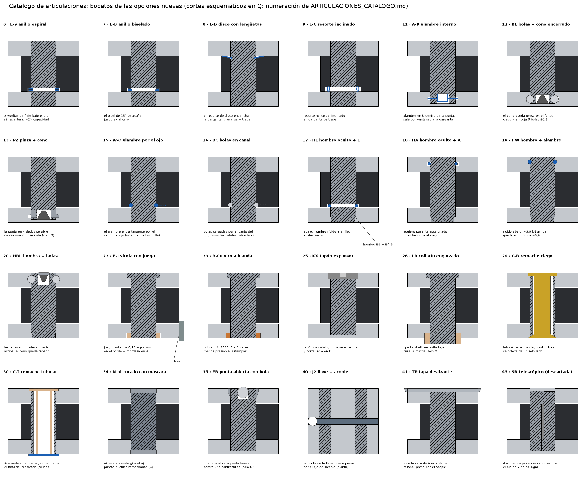

# Articulaciones Q1, Q2, O y C: catálogo de 50 opciones

Este catálogo reúne todas las formas de trabar los pasadores que salieron hasta ahora, más las nuevas, ordenadas por principio. El detalle de las primeras rondas (A a K, L, L2 y W) está en [ARTICULACIONES_OPCIONES.md](ARTICULACIONES_OPCIONES.md).

## Reglas que cumplen todas las viables

- No hay nada roscado.
- Traban por forma en los dos sentidos, o tienen redundancia.
- Quedan al ras.
- El juego del ojo es de 0 a 3 µm.
- Se fabrican con procesos de catálogo.

## Datos de partida

Medidos en el CAD:

| Pivote | Mejillas | Ojo | Pared libre alrededor del eje |
|---|---|---|---|
| Q1 / Q2 | 7075, 2,9 | 17-4 H900, 7 | 4,2 hacia la cara interior de A |
| O | 7075, 5,15 | 17-4 H900, 2,5 | 6,3 |
| C | 17-4 H900, 2,15 | 17-4 H900, 2,5 | 4,5 |

En Q **no conviene empujar la pared** desde una cajera: es lo que deja afuera a las opciones de estampado en ese pivote.

## Cómo leer las tablas

- **Traba ↓ / ↑:** qué impide que el pasador salga hacia abajo y hacia arriba.
- **Sirve en:** los pivotes donde la opción entra y cumple. P1 y P2 no necesitan traba.
- **Estado:**
  - **●** viable;
  - **◐** viable con reservas o con una prueba obligatoria;
  - **○** descartada (queda anotado el porqué, para no volver a pensarla).
- **Margen:** el de flexión del pasador a W = 35, sobre la carga que rompe la estructura. Por encima de 1, el pasador es más fuerte que la estructura.

---

## Familia 1 · Anillos y resortes encerrados

| # | Opción | Traba ↓ / ↑ | Sirve en | A favor | En contra | Estado |
|---|---|---|---|---|---|---|
| 1 | **A** · anillo oculto en la mejilla, pasador ciego | Fondo ciego / anillo | Q, O, C | Abajo no se ve nada; la garganta cae donde el momento es el 1 % | Garganta interior en el aluminio; anillo de 0,5 a 1 kN; no se ve si enganchó | ● |
| 2 | **L** · anillo encerrado entre el ojo y la mejilla | Anillo / anillo | Q, C | En el aluminio solo hay un agujero; el pasador queda al ras en las dos caras; el anillo hace de tope (al ras = enganchó) | Garganta donde el momento es el 56 % (Q) y el 80 % (C): margen 2,1 a 2,3 | ● |
| 3 | **L2** · un anillo en cada cara del ojo | 2 anillos / 2 anillos | Q, C | Dos trabas independientes, cada una para los dos sentidos | Distancia entre gargantas de ± 0,05 | ● |
| 4 | **K** · A + B juntos | Cabeza / virola + anillo | O (en Q choca con la pared fina) | Muy redundante | Un paso más; la virola empuja la pared | ◐ |
| 5 | **F** · casquillo + perno con anillo interno | Cabeza / cabeza + anillo | Q, O, C | Todo de torno; margen como macizo (2,4) | Anillo de ~0,5 kN que no se ve | ◐ |
| 6 | **L-S** · anillo espiral de dos vueltas (tipo Smalley) bajo el ojo | Anillo / anillo | Q, C | Sin abertura y con el doble de material en corte que el de alambre; es de catálogo | Necesita una garganta rectangular más ancha (0,9) | ● |
| 7 | **L-B** · anillo con bisel de 15° bajo el ojo | Anillo / anillo | Q, C | El bisel hace de cuña y deja **juego axial cero** sin depender del resorte | Anillo de catálogo de sección plana; la garganta biselada es más cara | ◐ |
| 8 | **L-D** · resorte de disco con lengüetas internas que caen en la garganta | Disco / disco | Q | Una sola pieza da la precarga y la traba (es tu idea de la arandela de precarga, usada como traba) | Pieza a medida (corte láser + temple); hay que probar la rigidez de las lengüetas | ◐ |
| 9 | **L-C** · resorte helicoidal inclinado en modo traba (tipo Bal Seal latching) | Resorte / resorte | Q, C | Es un producto diseñado para trabar ejes; con la garganta en modo "locking" no se suelta; además centra | Proveedor especial; capacidad que hay que consultar | ◐ |
| 10 | **L-P** · anillo de empuje sin garganta (push-on) bajo el ojo | Dientes / dientes | — | Sin garganta en el pasador | Los dientes no muerden un 440C de 58 HRC | ○ |
| 11 | **A-R** · pasador con un alambre de resorte adentro, que asoma por dos ventanas a la garganta de la mejilla | Fondo ciego / alambre | O, Q | El resorte trabaja adentro del pasador, protegido | Ventanas en la punta (momento del 1 al 7 %); hay que mecanizar antes del temple | ◐ |

## Familia 2 · Bolas, cuñas y alambres encerrados

| # | Opción | Traba ↓ / ↑ | Sirve en | A favor | En contra | Estado |
|---|---|---|---|---|---|---|
| 12 | **BL** · tres bolas en la punta hueca del pasador, empujadas por un perno cónico que queda encerrado en el fondo ciego | Fondo ciego / bolas | Q, O, C | Las bolas no trabajan como resorte (no hay fatiga); el perno queda preso entre el pasador y el fondo; es el principio de los pasadores de bolas | Punta hueca Ø2,5 hasta 1,8 de la cara (momento del 7 % en Q y del 20 % en C); tres agujeros de Ø1,5 antes del temple | ● |
| 13 | **PZ** · punta en pinza (4 dedos) abierta por un cono encerrado en el fondo ciego | Fondo ciego / dedos | O | Mucha superficie de traba | Los dedos debilitan la punta; sirve solo en mejillas gruesas | ◐ |
| 14 | **W** · alambre en canal | Alambre / alambre | O, Q | ~3,9 kN; no empuja la pared | Queda un punto de Ø0,9 en la cara; agujero inclinado | ● |
| 15 | **W-O** · alambre en canal entre el pasador y el ojo, que entra por el canto del ojo | Alambre / alambre (a través del ojo) | Q, C | Nada en las caras de la barra; el canto del ojo queda escondido en la horquilla | Garganta en zona de momento alto (como L); agujero tangente en el ojo | ◐ |
| 16 | **BC** · bolas en canal entre el pasador y el ojo, cargadas por el canto del ojo (como las rótulas hidráulicas) | Bolas / bolas | Q, C | Mucha capacidad; las bolas además centran | Hay que tapar el agujero de carga en el canto; muchas piezas sueltas al armar | ◐ |

## Familia 3 · Hombro oculto (una cabeza que no se ve)

El agujero de la mejilla de abajo es escalonado: Ø5 arriba y Ø4,6 abajo. El pasador tiene el mismo escalón, así que **no puede bajar** (traba de forma rígida) y abajo se ve un disco de Ø4,6 al ras. El escalón cae a ~1 de la cara exterior, donde el momento es el 1 %.

| # | Opción | Traba ↓ / ↑ | Sirve en | A favor | En contra | Estado |
|---|---|---|---|---|---|---|
| 17 | **HL** · hombro oculto + L | Hombro + anillo / anillo | Q, C | Abajo hay traba rígida y anillo: doble; nada empuja el aluminio | Escalón rectificado en el pasador; agujero escalonado con el mismo eje (se escaria de un lado) | ● |
| 18 | **HA** · hombro oculto + A | Hombro / anillo | O, Q | Igual a A, pero el fondo ciego pasa a ser un agujero pasante escalonado (más fácil de escariar y limpiar) | Igual que A: el anillo no se ve | ● |
| 19 | **HW** · hombro oculto + alambre en canal | Hombro / alambre | O | Rígido abajo y ~3,9 kN arriba | El punto de Ø0,9 | ● |
| 20 | **HBL** · hombro oculto + bolas | Hombro / bolas | O, Q | Igual a BL, pero las bolas trabajan solo hacia arriba | — | ● |

## Familia 4 · Deformar una pieza agregada

| # | Opción | Traba ↓ / ↑ | Sirve en | A favor | En contra | Estado |
|---|---|---|---|---|---|---|
| 21 | **B** · cabeza + virola de 304 estampada | Cabeza / virola | O, C | 3,5 kN; tope + marca visible | En Q empuja la pared de 0,75 | ● en O y C, ○ en Q |
| 22 | **B-J** · B con juego radial de 0,15, punzón solo en el borde interior y mordaza en la cara de A | Cabeza / virola | Q | Lleva B a Q | Hay que probarlo con una probeta que copie la pared; herramental propio | ◐ |
| 23 | **B-Cu** · virola de cobre o de aluminio 1050 recocido | Cabeza / virola | O, C | Se estampa con 3 a 5 veces menos presión | 1 a 2 kN; el cobre hace par galvánico con el aluminio | ◐ |
| 24 | **G** · tapón estampado en una contrasalida | Fondo ciego / tapón | O | 4,7 kN; la cara de arriba queda con un disco de inox. | En Q no (pared); fresa de cola de milano | ● en O |
| 25 | **KX** · tapón expansor de catálogo (tipo Koenig Expander) sobre el pasador ciego | Fondo ciego / tapón | O | Pieza normalizada con instalación controlada (se tira hasta que corta) | Expande radial: solo en paredes gruesas; deja un disco con un punto | ◐ |
| 26 | **LB** · collarín engarzado tipo lockbolt | Cabeza / collarín | O | Proceso industrial muy controlado | Necesita lugar alrededor para la matriz | ◐ |
| 27 | **PEM** · pasador de autoclinchado | Hombro / aluminio desplazado | O | Proceso de catálogo | El 7075-T6 está en el límite de dureza de esos insertos: consultar | ◐ |
| 28 | **C** · tubo de 440C + remache macizo aeronáutico | Cabeza / cabeza | Q, O, C | 4,6 kN; squeezer barato | El remache hincha el tubo ~10 µm y traba el ojo | ◐ |
| 29 | **C-B** · tubo + remache ciego estructural (tipo Cherry-Max) | Cabeza / bulbo | Q, O, C | Se coloca desde un solo lado; queda un anillo de traba mecánico | Mismo hinchado; cabeza de catálogo más grande que Ø6 | ◐ |
| 30 | **C-T** · tubo + remache tubular de inox. con arandela de precarga | Cabeza / pestaña | O, C | Poca fuerza; la arandela da la precarga y marca el final | Pestaña más débil (~1 kN) | ◐ |

## Familia 5 · Deformar el propio pasador

| # | Opción | Traba ↓ / ↑ | Sirve en | A favor | En contra | Estado |
|---|---|---|---|---|---|---|
| 31 | **E** · pasador de H1150 remachado | Cabeza / cabeza | C | Una sola pieza | Margen de 1,0 a 1,2; remachadora radial | ○ en Q y O, ◐ en C |
| 32 | **E-P** · remache con arandela de precarga que limita el recalcado (tu idea) | Cabeza / cabeza | C | La arandela marca la fuerza y el final | Sigue siendo un pasador blando | ◐ |
| 33 | **H** · temple parcial con puntas blandas remachadas | Cabeza / cabeza | Q, O, C | Margen de 2,1 a 4,0 | Temple por inducción local: proveedor especial | ◐ |
| 34 | **N** · 17-4 nitrurado, con las puntas enmascaradas (sin nitrurar) y remachadas | Cabeza / cabeza | C | Superficie dura para el ojo y puntas dúctiles; el nitrurado con máscara es de catálogo | Núcleo H1150: margen 1,2 | ◐ |
| 35 | **EB** · punta hueca abierta con una bola prensada contra una contrasalida | Fondo ciego / punta | O | Pequeño y oculto | Empuja la pared (solo en O); punta blanda | ◐ |

## Familia 6 · Unión de material y capas extra

| # | Opción | Traba ↓ / ↑ | Sirve en | A favor | En contra | Estado |
|---|---|---|---|---|---|---|
| 36 | **I** · soldadura láser de la punta al ala | Soldadura | C | ~3,7 kN; al ras al pulir | Servicio láser; el calor cerca del ojo | ◐ |
| 37 | **AD** · adhesivo de retención de alta resistencia (tipo Loctite 648) | Química | Todas | Agrega 1 a 2 kN | Por sí solo no es traba mecánica | Solo como capa extra |
| 38 | **ZC** · zunchado criogénico (interferencia de 25 a 35 µm, pasador enfriado) | Fricción | Todas | Multiplica la fricción por 3 | Fricción; en Q la pared se acerca a fluencia | Solo como capa extra |

## Familia 7 · Capturar con la arquitectura

| # | Opción | Traba ↓ / ↑ | Sirve en | A favor | En contra | Estado |
|---|---|---|---|---|---|---|
| 39 | **J** · llave longitudinal en la mejilla | Llave | Q | — | La llave también hay que trabarla | ○ |
| 40 | **J2** · llave longitudinal cuya punta queda presa por el eje de acople | Llave | Q1, Q2 | Usa una pieza que ya está; una llave traba dos pasadores | Sin el eslabón vecino acoplado la llave queda libre; cruza la zona del acople | ◐ |
| 41 | **TP** · tapa deslizante en cola de milano sobre toda la cara de A, presa por el acople | Tapa | Q1, Q2 | La cara queda continua: no se ve ningún pasador | Mismo problema que J2; agrega espesor o come la mejilla | ◐ |
| 42 | **2M** · barra A en dos mitades (cara de arriba y de abajo) unidas por cola de milano; pasadores ciegos en las dos | Encierro total | Q1, Q2 | Pasadores totalmente encerrados | Hay que trabar las mitades; pierde rigidez | ○ |
| 43 | **SB** · pasador telescópico con resorte (como los de las mallas de reloj) en agujeros ciegos cónicos | Encierro | — | No se ve nada | El ojo de 7 no da lugar para los dos medios pasadores retraídos | ○ |

## Familia 8 · Cambiar el tipo de pivote, y lo que ya no se piensa más

| # | Opción | Por qué no | Estado |
|---|---|---|---|
| 44 | **FX** · pivote flexible de flejes cruzados | El eslabón gira ~65° entre W 35 y 105; un fleje da ±15° | ○ |
| 45 | **MU** · muñones integrales en el ojo, en ranuras abiertas de las mejillas | La ranura hay que cerrarla con otra pieza trabada | ○ |
| 46 | **D** · estampar el 7075 sobre el pasador | Fisuras; no sirve en C | ○ |
| 47 | Pasador moleteado o estriado | Es solo fricción | ○ |
| 48 | Pasador elástico o espiral | Fricción y juego | ○ |
| 49 | Anillo en el centro del ojo | La garganta cae en el momento máximo | ○ |
| 50 | Imanes, tornillos de cualquier tipo, arandelas de lengüeta | Por requisito: o no traban por forma, o necesitan acceso | ○ |

---

## Las nuevas, explicadas

**6 · L-S, anillo espiral.**
- Dos vueltas de fleje plano de 0,3 × 0,9, encerradas igual que en L.
- No tiene abertura, así que el apoyo es parejo en toda la vuelta.
- Al no poder rodar, la capacidad pasa a depender del corte del fleje: del orden del doble que el alambre.

**7 · L-B, anillo biselado.**
- Es el principio de los anillos biselados de catálogo: el flanco de la garganta va a 15° y el anillo, empujado hacia adentro por su propio resorte, se acuña.
- Así no queda juego axial aunque las piezas tengan tolerancia.
- Es la única de la familia que elimina el juego axial con la traba misma.

**8 · L-D, disco con lengüetas.**
- El resorte de disco que ya va en Q, pero con 6 a 8 lengüetas internas que caen en la garganta del pasador.
- Hace dos trabajos en una pieza: precarga y traba.
- Riesgo: si las lengüetas son blandas, el disco sale empujando; hay que probarlo.

**9 · L-C, resorte inclinado.**
- Los fabricantes de resortes helicoidales inclinados ofrecen geometrías de garganta para "traba" (no se separa) además de las de "retención" (se separa con fuerza).
- Es un producto pensado justo para esto, con una ventaja más: centra el pasador.

**11 · A-R, alambre interno.**
- Un alambre de resorte doblado en U vive dentro de una punta hueca del pasador y asoma por dos ventanas a la garganta de la mejilla.
- Al prensar, el chaflán de la mejilla lo empuja hacia adentro y después salta.
- Diferencia con A: si algo lo empujara, el alambre se apoya en el propio pasador y no se puede escapar.

**12 · BL, bolas con perno cónico encerrado.**
- **Armado:**
  1. El perno cónico (acero templado) se deja suelto en el fondo del agujero ciego.
  2. Se prensa el pasador. Su punta hueca baja sobre el perno y el cono empuja tres bolas de Ø1,5 hacia afuera, a la garganta de la mejilla.
- **Resultado:** el perno queda preso entre el fondo y el pasador, y no hay resorte que se canse.
- **Control:** el pasador frena al ras cuando el cono se asienta.
- Es la versión permanente de un pasador de bolas.

**15 y 16 · W-O y BC, por el canto del ojo.**
- El canal queda entre el pasador y el ojo, y el alambre (o las bolas) entra por un agujero tangente en el canto del ojo.
- El canto queda dentro de la horquilla, así que las caras de la barra no muestran nada.
- Contra: la garganta cae donde el momento es alto, como en L.

**17 a 20 · Hombro oculto.**
- Es la forma más simple de tener una "cabeza" sin que se vea y sin cajera: un escalón de Ø5 a Ø4,6 dentro de la mejilla de abajo.
- Combinado con cualquier traba hacia arriba, deja abajo una traba rígida que no depende de nada.
- **HL (17)** es la más redundante sin tocar el aluminio:
  - hacia abajo traban el hombro y el anillo;
  - hacia arriba, el anillo;
  - y está la interferencia.

**22 · B-J.** Es la forma de usar B en Q:
- juego radial de 0,15 entre la virola y la cajera, para que el metal no llegue a la pared;
- un punzón que solo empuja el borde interior hacia la garganta;
- una mordaza que apoya la cara interior de A mientras se estampa.

**25 a 27 · Catálogo industrial.**
- Tapones expansores, collarines engarzados e insertos de autoclinchado son procesos con instalación controlada por la herramienta.
- Todos empujan radialmente, así que solo sirven en O.

**30 · C-T.** Un remache tubular de inox. (no macizo) hincha mucho menos el tubo. La arandela de precarga que propusiste marca el final del recalcado.

**34 · N, nitrurado con máscara.**
- 17-4 con la superficie nitrurada donde trabaja el ojo (no gripa) y las puntas enmascaradas, que siguen dúctiles para remacharlas.
- El problema es el núcleo H1150 (margen 1,2).

**40 y 41 · Captura por el acople.**
- La punta de la llave o de la tapa queda atravesada por el eje del acople con el eslabón vecino.
- Mientras la cadena está armada no sale. Desacoplada, queda libre, así que habría que sumar fricción o un anillo.

## Las mejores por articulación, hasta ahora

| Articulación | Más limpias | Más redundantes |
|---|---|---|
| Q1, Q2 | L (2), L-S (6), BL (12) | L2 (3), HL (17), HBL (20) |
| C | L (2), L-S (6) | L2 (3), HL (17) |
| O | A (1), BL (12), G (24) | HA (18), HW (19), B (21) |

Decime cuáles te gustan y las desarrollo a fondo (cotas, tolerancias, armado y probeta).
