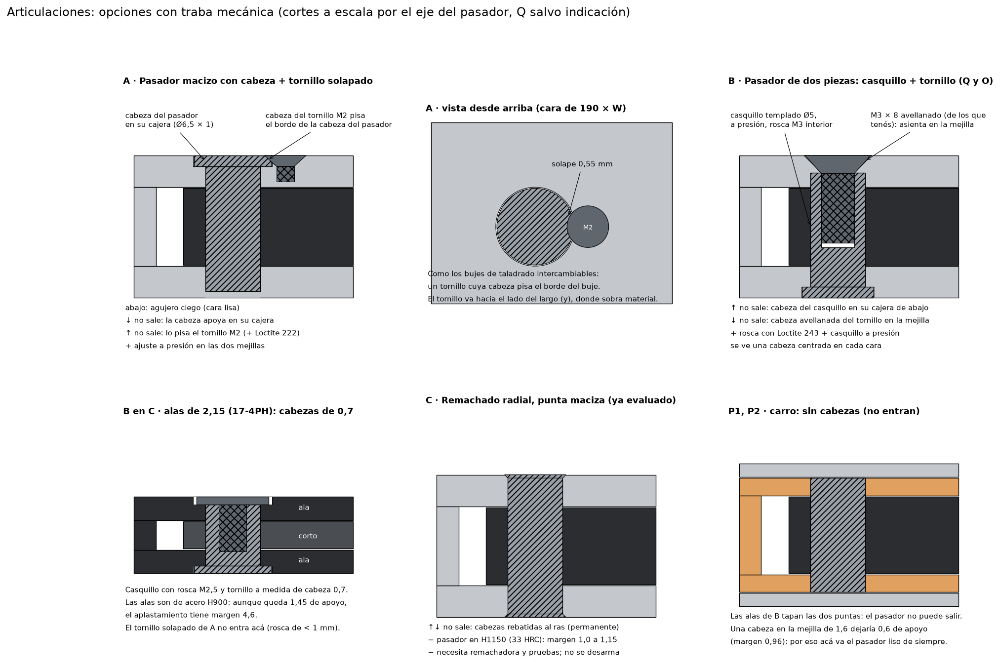

# Articulaciones: opciones con traba mecánica

Opciones reales para las seis articulaciones del diseño en metal. Los requisitos son:

- **Muy fuertes:** los pivotes ven hasta 5,5 kN a W = 35.
- **Sin piezas que se puedan desprender:** traba mecánica (de forma) en los dos sentidos, o muy redundante.
- **Sin juego, o muy poco.**
- **Al ras:** no puede sobresalir nada de las caras de 190 × ancho.

## Lo que no cambia en ninguna opción

- **El pasador va a presión en el aluminio** (interferencia de 7 a 20 µm, escariado después de anodizar). Así no hay juego ni microdeslizamiento en la mejilla, que es lo que desgasta los agujeros blandos.
- **El ojo gira sobre el pasador** y se aparea con él: holgura de 0 a 3 µm. Acero templado sobre acero templado, con grasa.
- **El resorte de disco** (Q1, Q2, P1, P2) o la arandela ondulada (O, C) eliminan el juego axial.
- **P1 y P2 siguen con el pasador liso de siempre.** Las alas de B tapan sus dos puntas, así que no puede salir: se mueve como mucho 0,1 mm. Una cabeza no entra en la mejilla del carro de 1,6 mm: dejaría 0,6 mm de apoyo y el aplastamiento quedaría con margen 0,96.

Quedan por resolver **Q1, Q2, O y C**, donde el pasador asoma al ras de una cara a la vista.

## Opción A · Pasador macizo con cabeza + tornillo de retención solapado

- **El pasador:** macizo, templado y rectificado, con una cabeza de Ø6,5 × 1,0 que entra en una cajera de la cara de arriba. Abajo el agujero es ciego, así que esa cara queda lisa.
- **El tornillo de retención:** un M2 avellanado, puesto a 4,6 mm del eje del pasador hacia el largo de la barra. Su cabeza pisa 0,55 mm del borde de la cabeza del pasador.
- **El principio:** es el mismo de los bujes de taladrado intercambiables, que se fijan con un tornillo cuya cabeza entra en una muesca del buje.

**Cómo queda retenido:**

| Sentido | Qué lo bloquea |
|---|---|
| Hacia abajo | La cabeza del pasador sobre el fondo de la cajera (forma) y el fondo del agujero ciego (forma) |
| Hacia arriba | La cabeza del tornillo M2 (forma), con Loctite 222 en la rosca |
| Además | Interferencia en las dos mejillas (400 a 1.100 N para sacarlo) |

**Resistencia a W = 35**, sobre la carga que rompe la estructura (733 N; un margen de 1 es igual a esa carga):

| Pivote | Flexión del pasador | Apoyo en la mejilla con la cajera |
|---|---:|---:|
| Q1 / Q2 | 2,8 | 3,0 |
| O | 2,4 | 5,7 |

- **Entra:** comprobado en el CAD, la rosca y la cabeza del M2 quedan en material macizo en Q1, Q2 y O.
- **No sirve en C:** las alas del eslabón 1 tienen 2,15 mm y la rosca del M2 quedaría de menos de 1 mm. C necesita la opción B.
- **Piezas:** el pasador con cabeza es de catálogo configurable. Por ejemplo, el pin de posicionamiento con brida plana para presión de Misumi, en 440C, con las medidas y tolerancias a elección. El tornillo es un M2 estándar.
- **Se desarma:** se saca el M2 y se empuja el pasador con un botador.
- **Aspecto:** en la cara de arriba se ve el disco de la cabeza y, al lado, la cabeza chica del M2. La cara de abajo queda lisa.

## Opción B · Pasador de dos piezas: casquillo con cabeza + tornillo avellanado (recomendada)

- **El casquillo:** templado y rectificado, Ø5 por fuera. Tiene cabeza de Ø6,5 × 1,0 abajo, en una cajera, y rosca M3 por dentro. Va **a presión en las dos mejillas** y el ojo gira sobre su exterior.
- **El tornillo:** un **M3 × 8 avellanado** (de los que ya tenés) entra desde arriba, rosca en el casquillo y asienta en un avellanado de la mejilla de arriba.
- **El principio:** es un «tornillo de Chicago», o de encuadernar, pero con el casquillo templado y a presión.

**Cómo queda retenido:**

| Sentido | Qué lo bloquea |
|---|---|
| Hacia arriba | La cabeza del casquillo sobre su cajera de abajo (forma) |
| Hacia abajo | La cabeza avellanada del tornillo sobre la mejilla de arriba (forma) |
| Además | La rosca, con Loctite 243, y el casquillo a presión en las dos mejillas. Si el tornillo se aflojara, el casquillo sigue fijo por la interferencia y el tornillo no tiene por dónde caer hasta destornillarse del todo. |

**En C:** como las alas son de 2,15 mm, se usa la misma idea en chico: casquillo con rosca M2,5 y un tornillo **a medida de cabeza Ø6,5 × 0,7**. Como las alas son de acero H900, aunque quedan 1,45 mm de apoyo el aplastamiento tiene margen 4,6.

**Resistencia a W = 35**, sobre 733 N. El casquillo es un tubo (pierde algo frente al macizo):

| Pivote | Casquillo 17-4PH H900 | Casquillo 440C templado |
|---|---:|---:|
| Q1 / Q2, flexión | 1,9 | 2,7 |
| O, flexión | 1,6 | 2,3 |
| C, flexión | 3,1 | 4,4 |
| Corte doble | 3,1 | – |

**Material del casquillo: 440C templado** (≈ 58 HRC). Además de ser más fuerte, el ojo de 17-4PH H900 (44 HRC) gira sobre un acero más duro. 17-4PH sobre 17-4PH tiende a engranarse (gripar) por su misma dureza.

**Apoyo en las mejillas:** la mejilla de arriba de Q queda con 1,2 mm cilíndricos, porque el avellanado ocupa 1,7. El margen de aplastamiento es 1,9. En O sobra (5,15 mm de mejilla).

**Ventajas sobre A:**
- La misma solución sirve para Q1, Q2, O y C.
- Las dos direcciones quedan trabadas por cabezas centradas, sin un tornillo al costado.
- Se ve una cabeza centrada en cada cara, simétrico, como un remache prolijo.
- El tornillo de Q y O es estándar.
- Se desarma con una llave.

**Desventajas:**
- El casquillo es una pieza a medida: torneado, templado, rectificado por fuera y roscado por dentro. Es fácil de mecanizar, pero no es de catálogo.
- El margen a flexión es menor que con el macizo, aunque sigue por encima de la estructura en todos los pivotes.

## Opción C · Pasador remachado con punta maciza (la ya evaluada)

- **Cómo es:** pasador a presión con las dos puntas rebatidas por remachado radial contra un avellanado de 0,3 × 45°, al ras.
- **Retención:** traba de forma en los dos sentidos. Es permanente y no tiene piezas extra.
- **Contras:**
  - El pasador tiene que ser deformable (17-4PH H1150, 33 HRC), así que el margen a flexión baja a **1,0 a 1,15**. Es el más justo de todas las opciones.
  - El ojo gira sobre un acero más blando que él.
  - Necesita remachadora con tope de altura y pruebas del proceso.
  - No se desarma: hay que perforarlo.

## Comparación

| | A · Cabeza + tornillo solapado | **B · Casquillo + tornillo** | C · Remachado |
|---|---|---|---|
| Traba hacia abajo | Forma (cabeza + ciego) | Forma (cabeza del tornillo) | Forma |
| Traba hacia arriba | Forma (tornillo M2) | Forma (cabeza del casquillo) | Forma |
| Redundancia | Presión + Loctite | Presión + rosca + Loctite | Presión |
| Margen del pasador a W = 35 | 2,4 a 2,8 | 2,3 a 2,7 (440C) | 1,0 a 1,15 |
| Sirve en C | No | Sí (tornillo a medida) | Sí |
| Juego en el aluminio | 0 (presión) | 0 (presión) | 0 (presión) |
| Se desarma | Sí | Sí | No |
| Aspecto | Disco + tornillo chico al lado; abajo liso | Una cabeza centrada por cara | Remache al ras por cara |
| Piezas especiales | Pasador con brida (catálogo configurable) | Casquillo a medida; tornillo a medida solo en C | Remachadora + pruebas |

**Recomendación: B** en Q1, Q2, O y C, con casquillo de 440C, y el pasador liso de siempre en P1 y P2. Es la única que resuelve las cuatro articulaciones con la misma idea y que traba los dos sentidos con cabezas, sin depender de un tornillo al costado. Tiene tres trabas independientes, conserva la interferencia (sin juego en el aluminio) y deja el margen del pasador por encima de 2 con 440C.

Si preferís el pasador macizo en Q y O, la combinación **A en Q1, Q2 y O + B en C** también funciona.

## Juego radial: tres niveles

El juego que queda está en el ojo, porque en el aluminio es cero en las tres opciones. A W = 35 el mecanismo lo multiplica por 15 entre los ejes de acople.

| Nivel | Cómo | Juego del ojo | Juego entre ejes a W = 35 / W = 70 |
|---|---|---:|---:|
| 1 · Apareado | Ojo escariado a H6, medido con calibres de 1 µm, con un pasador o casquillo clasificado | 0 a 3 µm | ≤ 0,09 / 0,02 mm |
| 2 · Asentado | Además, lapeado del ojo con su propio pasador hasta que gire sin juego y sin esfuerzo | 0 a 1 µm | ≤ 0,03 / 0,01 mm |
| 3 · Conos precargados | Asientos cónicos en el ojo, empujados por el resorte de disco: el juego se va a cero y se compensa con el desgaste | 0 | 0 |

- **Nivel 1 o 2.** Para comparar, 0,09 mm entre ejes a W = 35 es lo que el conjunto se deforma con 13 N de carga. El nivel 2 es un paso de taller más, sin piezas nuevas.
- **Nivel 3, solo si hace falta.** Necesita conos rectificados de a pares y deja más fricción al regular. Lo desarrollaría solo si la medición del prototipo en metal muestra que el nivel 2 no alcanza.

## Qué falta para elegir

1. **Opción:** confirmame cuál querés (recomiendo B) y si los casquillos van en 440C.
2. **Nivel de juego:** 1 o 2.
3. **Después:** lo paso al CAD, con cajeras, avellanados y los casquillos y tornillos como piezas. Recalculo la resistencia con las mejillas recortadas y verifico choques en todo el recorrido. En el prototipo impreso se puede probar la misma idea con un casquillo impreso y un M3.
