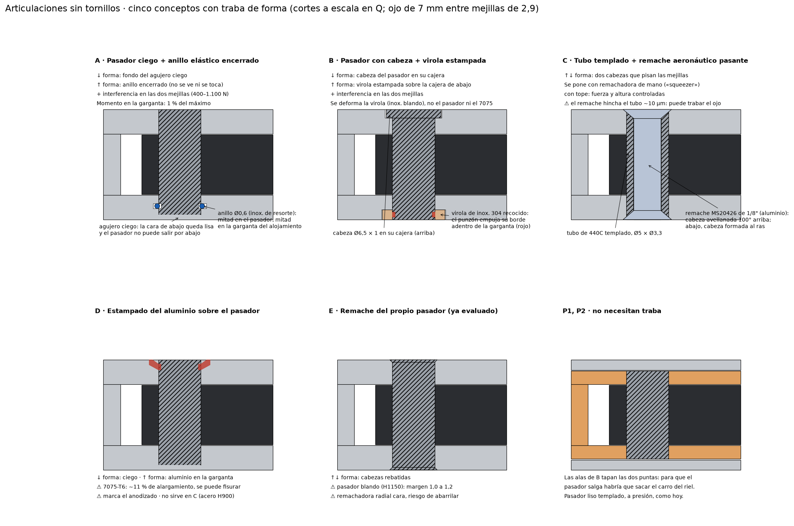
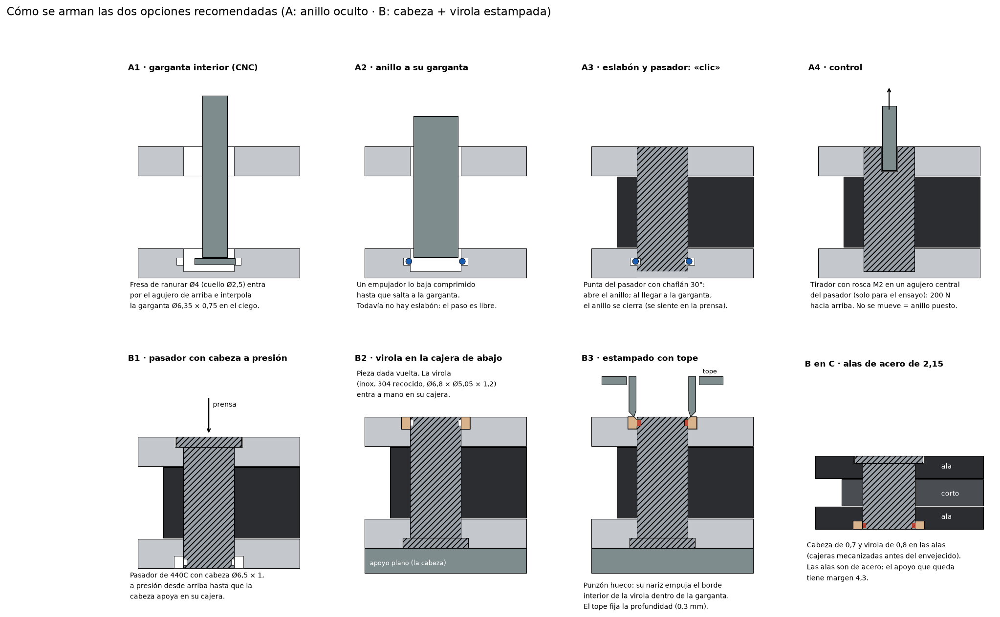
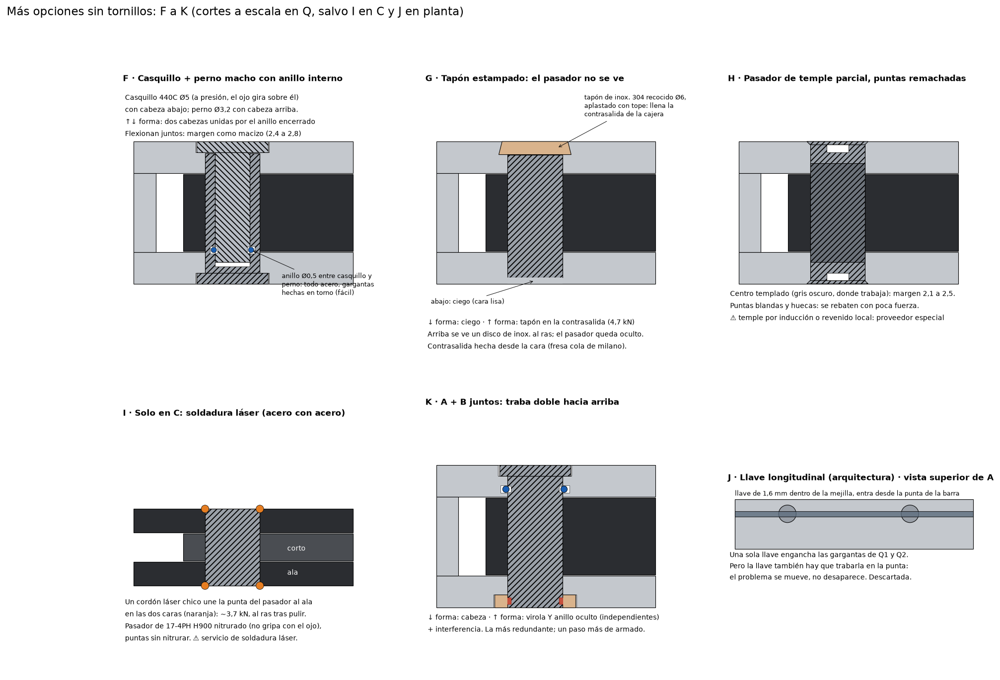
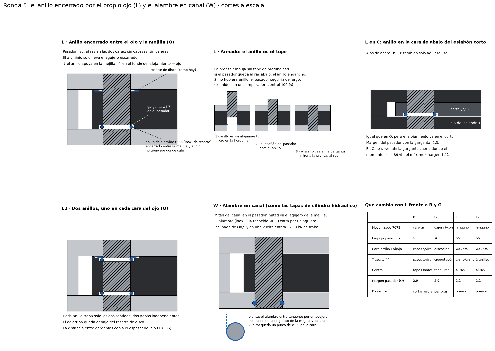

# Articulaciones: estudio de opciones sin tornillos

Estudio de cómo hacer las articulaciones del diseño en metal. Los números salen de `articulaciones_calc.py`.

## 1. Qué tiene que cumplir

| Requisito | Detalle |
|---|---|
| Fuerza | Hasta **5,5 kN por pivote** a W = 35 (con la carga que rompe la estructura: 733 N entre ejes) |
| Nada que se desprenda | **Sin tornillos ni roscas** (cualquier tornillo puede aflojarse) y sin piezas que puedan salir. Traba **de forma** y, si se puede, redundante |
| Sin juego | Radial y axial cero o casi cero. A W = 35 el mecanismo multiplica por 15 el juego del ojo entre los ejes de acople |
| Al ras | Nada sobresale de las caras de 190 × ancho |
| Fabricable | CNC normal (Rapid Direct) y armado con herramientas de taller razonables, sin máquinas caras |
| Espacio | 13 mm de espesor; mejillas de 2,9 (Q), 5,15 (O), 2,15 de acero (C) y 1,6 (P); pasador de Ø5 |

**P1 y P2 no necesitan traba:** las alas de B tapan las dos puntas del pasador, que para salir necesitaría sacar el carro del riel. Quedan **Q1, Q2, O y C**.

## 2. Qué hace una articulación, función por función

Separando las funciones se ve que solo una de ellas, la retención del pasador, quedaba sin resolver. Las demás ya están cubiertas y ninguna opción las cambia:

| Función | Cómo se resuelve (igual en todas las opciones) |
|---|---|
| Llevar la carga | Pasador macizo templado Ø5 en doble corte |
| Girar | El ojo (17-4PH H900, 44 HRC) gira sobre el pasador templado (440C, ≈ 58 HRC). Dureza distinta: no se engrana |
| Juego radial en el aluminio | Pasador **a presión** en las mejillas (7 a 20 µm): no se mueve ni se gasta el agujero blando |
| Juego radial en el ojo | Ojo apareado con el pasador (0 a 3 µm), o lapeado (0 a 1 µm). Ver sección 7 |
| Juego axial y cabeceo | Resorte de disco (Q, P) o arandela ondulada (O, C) |
| **Retención del pasador** | **Es lo que hay que elegir** |

Dato clave: **en servicio el pasador no tiene fuerza axial.** El resorte empuja entre las dos mejillas, que son la misma pieza, y los momentos fuera del plano flexionan el pasador, no lo empujan. Un golpe de 1.000 g sobre un pasador de 1,5 g son 15 N. La traba no tiene que aguantar una carga: tiene que hacer **imposible** que el pasador camine, aunque pasen años de vibración.

## 3. Todas las formas de trabar un pasador sin rosca

| Principio | Ejemplo | ¿Sirve? | Por qué |
|---|---|---|---|
| Cautivo por la arquitectura | P1 y P2 bajo las alas | Solo en P | En Q, O y C la punta queda en una cara a la vista. Taparla exige otra pieza fija, y el problema se repite |
| **Anillo elástico encerrado** | Anillo de alambre entre dos gargantas | **Sí (A)** | Forma, oculto y sin herramienta especial |
| **Deformar una pieza blanda agregada** | Virola estampada sobre una garganta del pasador | **Sí (B)** | Forma y visible; el pasador no se toca |
| Remache pasante en un tubo | Tubo templado + remache aeronáutico | Con riesgo (C) | El remache hincha el tubo y puede trabar el ojo |
| Deformar el alojamiento | Estampado del 7075 | Con riesgo (D) | El 7075 es poco dúctil; no sirve en C |
| Deformar el propio pasador | Remache radial | Con riesgo (E) | Pasador blando, margen ≈ 1 |
| Pasador fijo al ojo y giro en bujes en las mejillas | Muñones | No | Dos superficies que giran (el doble de juego), bujes en mejillas de 1,6 a 2,9 y el pasador no entra en la horquilla cerrada |
| Interferencia sola o por contracción | Ajuste a presión, nitrógeno líquido | Solo como redundancia | Es fricción, no forma |
| Pasador elástico (Spirol, Mecanindus) | Pasador partido | No | Es fricción; el ojo giraría sobre una ranura |
| Adhesivo | Loctite 648 | Solo como redundancia | Es química, no forma |
| Soldadura | Láser | No | El acero no se suelda al aluminio. En C (acero) el calor arruina el H900 y el temple del pasador |
| Anillo de retención a la vista | Seeger en la cara | No | Sobresale y se saca con una pinza |

Siguen cinco conceptos (A a E). Están desarrollados abajo con medidas, cálculo, proceso, modos de falla y control.

## 4. Los conceptos en detalle

Los márgenes son a W = 35, sobre la carga que rompe la estructura: margen 1 es igual a esa carga y por encima de 1 la articulación es más fuerte que la estructura. El modelo de flexión es el mismo de `analisis.py`.

### A · Pasador ciego + anillo elástico encerrado

**Geometría:**
- **Pasador:** 440C templado y rectificado Ø5 (m6, o apareado al ojo). Tiene la punta con chaflán de 30° para abrir el anillo y una **garganta de Ø4,4 × 0,7** a 1,3 mm de la punta.
- **Alojamiento:** el agujero de la mejilla de abajo es **ciego** (piso de 0,6 mm: la cara de abajo queda lisa) y tiene una **garganta interior de Ø6,35 × 0,75** a la altura de la del pasador.
- **Anillo:** alambre de resorte inoxidable (1.4568 / 17-7PH o 1.4310) de Ø0,6, con Ø interior libre de 4,7. Al pasar el pasador se abre a 5,05, con una tensión de 1.350 MPa, por debajo del límite del alambre (1.600 a 1.700). Ya cerrado, se mete 0,15 mm en la garganta del pasador y 0,45 mm en la del alojamiento.

**Traba:**
- **Hacia abajo:** de forma, por el fondo del agujero ciego.
- **Hacia arriba**, la única salida: de forma, por el anillo, que aguanta del orden de 0,5 a 1 kN (estimado: el anillo puede rodar en la garganta), y además la interferencia (0,4 a 1,1 kN).
- **Variante redundante:** un segundo anillo en la mejilla de arriba. Las gargantas del pasador llevan el flanco de arriba en rampa de 30°, para que el pasador pueda bajar a través del primer anillo, y el de abajo recto, que es el que traba. Así quedan dos trabas de forma independientes para el único sentido de salida.

**Resistencia:**

| Pivote | Flexión del pasador | Aplastamiento |
|---|---:|---:|
| Q | 2,6 | 3,7 |
| O | 2,2 | 6,2 |
| C | 4,4 | 4,9 |

La garganta queda donde el momento es el **1 %** del máximo (en C, el 7 %), así que no debilita el pasador.

**Fabricación y armado:**
1. La garganta interior se hace en el CNC con una fresa de ranurar de Ø4 y cuello de Ø2,5, que entra por el agujero de arriba (sin el eslabón puesto) e interpola el círculo. En C se hace en el ala antes del envejecido H900.
2. El anillo se baja comprimido con un empujador hasta que salta a su garganta.
3. Se pone el eslabón con su resorte.
4. Se prensa el pasador: al cerrarse el anillo se siente en la prensa.

**Control:** el pasador lleva un agujero central roscado M2 que solo usa el tirador del ensayo (no queda ningún tornillo). Se tira con 200 N: si no se mueve, el anillo está puesto.

**Modos de falla:**

| Falla | Qué la evita |
|---|---|
| Anillo mal asentado | El ensayo de 200 N, en todas las articulaciones |
| Anillo que se abre con el tiempo | Queda sin tensión, encerrado; no hay nada que lo abra |
| Corrosión | Inoxidable y grasa en el agujero |

**Aspecto:** arriba se ve solo el disco del pasador (Ø5) al ras; abajo, nada. **No se desarma:** hay que perforar el pasador.

### B · Pasador con cabeza + virola estampada (recomendada)

**Geometría:**
- **Pasador:** 440C templado y rectificado Ø5 con **cabeza de Ø6,5 × 1,0** (Ø6,5 × 0,7 en C), en una cajera de la cara de arriba. En la punta de abajo tiene una **garganta de Ø4,4 × 0,6**. Se consigue como pin de posicionamiento con brida para presión, configurable (Misumi lo ofrece en 440C), o a medida.
- **Virola:** anillo de **inox. 304 recocido** de Ø6,8 × Ø5,05 × 1,2 (0,8 en C), en una cajera de la cara de abajo.
- **Estampado:** un punzón hueco con tope de profundidad empuja el borde interior de la virola dentro de la garganta del pasador.

**Traba:**
- **Hacia abajo:** de forma, por la cabeza del pasador sobre su cajera.
- **Hacia arriba:** de forma, por la virola estampada sobre su cajera. Para sacarla hay que cortar el metal de la virola dentro de la garganta, unos **3,5 kN**.
- **Además:** la interferencia. Son dos trabas de forma independientes, una por sentido, más la fricción.

**Resistencia:**

| Pivote | Flexión del pasador | Aplastamiento |
|---|---:|---:|
| Q | 2,9 | 2,7 |
| O | 2,5 | 5,4 |
| C | 4,8 | 4,3 |

La cajera de Ø6,9 en Q deja 0,75 mm de pared hasta la cara interior de A; lo comprobé en el CAD. Ni las cajeras ni las gargantas tocan el túnel del cable.

**Por qué es la más controlable:**
- **Se deforma una pieza agregada, blanda y muy dúctil** (304 recocido, alargamiento de 40 %), no el pasador ni el 7075. Nada se abarrila.
- **La deformación la fija el tope del punzón**, no la fuerza: siempre queda igual.
- **Alcanza con una prensa de mano** (de cremallera, 1 a 2 t). El estampado pide del orden de 5 a 6 kN, que se descargan sobre la cabeza del pasador, apoyada en una base plana. La cajera de aluminio ve unos 250 MPa, por debajo del aplastamiento admisible.
- **Se ve si está bien hecho:** la marca del punzón queda en la virola.

**Armado:**
1. Pasador a presión desde arriba, hasta que la cabeza apoya.
2. Se da vuelta la pieza.
3. Virola a mano en su cajera.
4. Se estampa con la prensa hasta el tope.
5. Ensayo de 300 N empujando desde abajo.

**Modos de falla:**

| Falla | Qué la evita |
|---|---|
| Estampado incompleto | El tope y el ensayo de 300 N |
| Virola fisurada | El 304 recocido no se fisura con 0,3 mm de deformación |
| Corrosión | Inox. 304 en aluminio anodizado: sellar la cajera con grasa o barniz |

**Aspecto:** arriba, el disco de la cabeza (Ø6,5); abajo, la punta del pasador dentro de un anillo de inox. de Ø6,8, los dos al ras. **No se desarma:** hay que cortar la virola.

### C · Tubo templado + remache aeronáutico pasante

- **Cómo es:** el pasador es un **tubo de 440C** de Ø5 × Ø3,3, con las puntas avellanadas a 100° antes del temple. Por adentro pasa un **remache macizo de 1/8"** (MS20426, de aluminio 2117), con la cabeza avellanada arriba y la cabeza formada al ras en un avellanado abajo. Las dos cabezas pisan la mejilla (Ø5,72 > Ø5).
- **Traba:** de forma en los dos sentidos (4,6 kN, por aplastamiento de la cabeza sobre la mejilla).
- **Herramienta:** remachadora de mano «squeezer», la de los que construyen aviones caseros. Es barata, la altura queda fija por la matriz y no hay golpes.
- **Resistencia del tubo:**

  | Pivote | Margen |
  |---|---:|
  | Q | 2,3 |
  | O | 2,0 |
  | C | 4,3 |

- **El problema:** al remachar, el remache se hincha dentro del tubo y empuja hacia afuera. Con unos 250 MPa, **el tubo crece ~10 µm de diámetro**, más que la holgura del ojo (0 a 3 µm), y **el ojo quedaría trabado**. Habría que dejar el interior del tubo más grande en la zona del ojo, o aceptar más holgura. **Queda como alternativa, con prueba obligatoria.**

### D · Estampado del aluminio sobre el pasador

- **Cómo es:** como B, pero en lugar de la virola se empuja el **7075** del borde del agujero dentro de la garganta del pasador.
- **Traba:** de forma; unos 3,7 kN.
- **Problemas:**
  - El 7075-T6 tiene ~11 % de alargamiento y se puede **fisurar** en el borde.
  - El anodizado se rompe alrededor.
  - **No sirve en C**, porque las alas son de acero H900.
- **Conclusión:** B hace lo mismo con una pieza que sí se deja deformar, así que D queda descartada frente a B.

### E · Remache del propio pasador

- **Cómo es:** traba de forma, permanente.
- **Problemas:**
  - El pasador tiene que ser deformable (H1150), con **margen 1,0 a 1,2**.
  - Hay riesgo de abarrilar.
  - Necesita remachadora radial con tope, que es cara.
- **Conclusión:** queda por debajo de B en todo.

## 5. Cada concepto en cada articulación

| | Q1 / Q2 (7075, 2,9) | O (7075, 5,15) | C (acero H900, 2,15) | P1 / P2 |
|---|---|---|---|---|
| **A** anillo oculto | Sí | Sí | Sí (garganta antes del envejecido) | No hace falta |
| **B** cabeza + virola | Sí | Sí | Sí (cabeza de 0,7, virola de 0,8) | No hace falta |
| C tubo + remache | Sí, con riesgo de trabar el ojo | Ídem | Ídem | No hace falta |
| D estampado del aluminio | Riesgo de fisura | Riesgo de fisura | No | No hace falta |
| E remache del pasador | Margen 1,2 | Margen 1,0 | Margen 2,0 | No hace falta |

## 6. Comparación y recomendación

| Criterio | A · Anillo oculto | **B · Cabeza + virola** | C · Tubo + remache | D · Estampado Al | E · Remache |
|---|---|---|---|---|---|
| Traba de forma ↓ / ↑ | Ciego / anillo | Cabeza / virola | Cabeza / cabeza | Ciego / aluminio | Cabeza / cabeza |
| Redundancia | Interferencia (+ 2.º anillo) | Interferencia | Interferencia | Interferencia | Interferencia |
| Capacidad de la traba | 0,5 a 1 kN (estimado) | 3,5 kN | 4,6 kN | 3,7 kN | Alta |
| Margen del pasador (peor pivote) | 2,2 | 2,5 | 2,0 | 2,0 | 1,0 |
| Riesgo para el juego del ojo | Ninguno | Ninguno | **Alto** (hinchado) | Ninguno | Medio (pasador blando) |
| Control del proceso | Clic + ensayo con tirador | **Tope + marca visible + ensayo** | Matriz del squeezer | Tope (fisuras) | Máquina con tope |
| Herramientas | CNC (fresa de ranurar) + prensa | Prensa de mano + punzón | Squeezer + matrices | Prensa + punzón | Remachadora radial |
| Aspecto | **Arriba un disco, abajo nada** | Disco arriba, anillo inox. abajo | Remache en las dos caras | Disco + marca | Remache al ras |
| Se ve que está bien | No (hace falta el ensayo) | **Sí** | Sí | Sí | Sí |
| Desarme | Perforar | Cortar la virola | Perforar el remache | Perforar | Perforar |

**Recomendación: B (cabeza + virola estampada) en Q1, Q2, O y C**, y el pasador liso de siempre en P1 y P2.
- Traba por forma los dos sentidos con elementos independientes.
- No deforma ni el pasador ni el 7075.
- La deformación la controla un tope, así que no depende de la fuerza.
- Se inspecciona a la vista.
- Usa una prensa de mano.
- Deja el margen del pasador en 2,5 o más.

**Alternativa: A (anillo oculto)**, si importa más que **no se vea nada** en la cara de abajo y aceptás que la traba no se ve (control por ensayo). Con dos anillos es la más redundante en el único sentido de salida.

## 7. Juego: presupuesto por articulación

| Fuente | Valor | Cómo se elimina |
|---|---|---|
| Pasador en el aluminio | 0 | Interferencia de 7 a 20 µm; con +50 °C pierde 3 µm |
| Ojo sobre el pasador | 0 a 3 µm (apareado) o 0 a 1 µm (lapeado) | Medición y apareo; o lapeado de cada ojo con su pasador |
| Axial / cabeceo | 0 hasta ≈ 1 N·m por pivote | Resorte de disco de ≈ 250 N |
| Carro en el riel | Depende de la traba (pendiente) | Diseño de la traba |

**Juego entre ejes al invertir la carga:**

| Ajuste del ojo | W = 35 | W = 70 |
|---|---:|---:|
| Apareado | ≤ 0,09 mm | ≤ 0,02 mm |
| Lapeado | ≤ 0,03 mm | ≤ 0,01 mm |

Para comparar, el conjunto se deforma 0,09 mm con 13 N a W = 35. Si hiciera falta juego cero absoluto, el paso siguiente es un **pivote de conos precargados** (sección 8 de la ronda anterior). Sirve con A y con B.

## 8. Antes de decidir: muestras de prueba

En una tarde de taller se valida el concepto elegido antes de llevarlo al diseño:

1. **Probetas:**
   - Dos placas de 7075 de 2,9 mm con un separador de acero de 7 mm, que hace de ojo, para Q.
   - Una plaqueta de 17-4PH H900 de 2,15 para C.
   - Tres o cuatro pasadores de cada variante.
2. **Medir:**
   - El par de giro del ojo antes y después de trabar: no debe cambiar.
   - El empuje hasta que la traba cede (esperado: > 1 kN en B).
   - El aspecto de la cara.
3. **Cortar** una probeta al medio para ver cómo quedó la virola (B) o el anillo (A).

---

## 9. Ronda 4: más opciones (F a K)

Se aplican las mismas reglas: nada roscado, traba de forma en los dos sentidos, nada sobresale y juego del ojo de 0 a 3 µm. Los márgenes salen de `articulaciones_calc.py` a W = 35, contra la carga que rompe la estructura.

### F · Casquillo + perno macho con anillo interno

- **Geometría:**
  - Casquillo de 440C Ø5 / Ø3,2 con cabeza abajo (Ø6,5 × 1,0, 0,7 en C), a presión en la mejilla de abajo. El ojo gira sobre el casquillo.
  - Perno macho Ø3,2 con cabeza arriba, ajustado (g6/H6) dentro del casquillo.
  - Un anillo de alambre de Ø0,5 queda encerrado entre una garganta del perno y otra del interior del casquillo, justo bajo la mejilla de arriba.
- **Traba:**
  - ↓ la cabeza del casquillo; ↑ la cabeza del perno.
  - Las dos cabezas se unen por el anillo, que queda encerrado y no puede salir.
  - Además, el casquillo entra con interferencia.
- **Margen:** el perno y el casquillo flexionan juntos, así que la sección es casi la de un pasador macizo. Peor caso 2,4 (O); Q 2,8 y C 4,6.
- **Fabricación:** todo de torno. La garganta interior del casquillo se hace con una herramienta de ranurar interior, que es estándar.
- **Puntos débiles:**
  - El anillo aguanta ~0,5 kN (acero contra acero, poca garganta). Sobra, porque no hay carga axial en servicio, pero es la traba más chica de la ronda.
  - No se ve si el anillo entró: hace falta el ensayo con tirador.
  - Las dos caras muestran una cabeza rebajada, como en B.

### G · Pasador ciego + tapón estampado con contrasalida

- **Geometría:**
  - Agujero ciego en la mejilla de abajo (cara lisa) y pasante en la de arriba.
  - Encima del pasador, una cajera Ø6 × 1,2 con contrasalida de 0,3 (cola de milano, hecha desde la cara).
  - Un tapón de inox. 304 recocido se aplasta contra un tope: llena la contrasalida y queda al ras.
- **Traba:**
  - ↓ el fondo ciego; ↑ el tapón, que queda trabado por forma en el aluminio.
  - Además, el pasador entra con interferencia.
- **Capacidad:** corte del tapón en la contrasalida ≈ 4,7 kN, la más alta junto con C.
- **Margen:** igual que B (2,5 en O, 2,9 en Q, 4,8 en C).
- **Control:**
  - La deformación la fija el tope del punzón, no la fuerza.
  - Se ve: el disco tiene que quedar al ras y lleno.
- **Aspecto:** arriba un disco de inox. al ras (el pasador no se ve), abajo nada. Es la versión de A que **sí** se inspecciona a la vista.
- **Puntos débiles:**
  - La pared entre la cajera y la cara interior de A queda en **0,9 mm** en Q. Alcanza, pero no hay que agrandar la cajera.
  - La contrasalida pide una fresa de cola de milano chica. Es una herramienta de catálogo, pero hay que confirmarla con el taller.
  - Desarme: perforar el tapón.

### H · Pasador de temple parcial con puntas remachadas

- **Idea:** el centro del pasador está templado (donde trabaja el ojo) y las puntas, blandas y huecas, se rebaten con poca fuerza.
- **Margen:** 2,1 (O) a 4,0 (C), porque el remache come solo 0,3 de cada mejilla.
- **Problemas:**
  - Necesita temple por inducción o revenido local: un proveedor especial, fuera de lo estándar de Rapid Direct.
  - Sigue siendo un remache: necesita una máquina con tope y existe el riesgo de abarrilarlo, que es lo que se quería evitar.
- **Queda como reserva.**

### I · Solo en C: soldadura láser

- **Idea:** pasador de 17-4PH H900 nitrurado (para que no gripe con el ojo), con las puntas sin nitrurar. Un cordón láser chico une cada punta al ala de acero.
- **Capacidad:** ~3,7 kN, al ras después de pulir.
- **Problemas:**
  - Solo sirve en C, que es acero contra acero; el 7075 no se suelda.
  - Hace falta un servicio de soldadura láser.
  - El calor local puede tocar el ajuste del ojo, así que hay que verificarlo con probeta.
  - No se desarma.

### K · A + B juntos

- **Traba:** ↓ cabeza; ↑ virola estampada **y** anillo oculto, que actúan independientes. Además, interferencia.
- **Margen:** el de B (2,5).
- **Ventaja:** es la más redundante. Para que salga el pasador tienen que fallar dos trabas distintas por mecanismos distintos.
- **Costo:** una garganta y un paso de armado más.

### J · Llave longitudinal (descartada)

Una llave de 1,6 mm a lo largo de la mejilla de A enganchaba las gargantas de Q1 y Q2 a la vez. Pero la llave también hay que trabarla en la punta de la barra: el problema se mueve, no desaparece.

### Comparación de toda la familia

| Concepto | Traba ↓ / ↑ | Capacidad ↑ | Margen (peor) | Se ve que está bien | Proceso | Taller estándar |
|---|---|---|---|---|---|---|
| A anillo oculto | Ciego / anillo | 0,5 a 1 kN | 2,2 | No | Clic | Sí |
| **B cabeza + virola** | Cabeza / virola | 3,5 kN | 2,5 | Sí | Tope | Sí |
| F casquillo + perno | Cabeza / cabeza + anillo | ~0,5 kN | 2,4 | No | Clic | Sí (torno) |
| **G tapón estampado** | Ciego / tapón | 4,7 kN | 2,5 | Sí | Tope | Sí (confirmar la fresa) |
| H temple parcial | Remache / remache | Alta | 2,1 | Sí | Remachadora | No |
| I láser (solo C) | Soldadura | ~3,7 kN | — | Sí | Láser | No |
| **K A + B** | Cabeza / virola + anillo | 3,5 kN + anillo | 2,5 | En parte | Tope + clic | Sí |

### Recomendación después de la ronda 4

1. **B sigue siendo la base:** es simple, tiene traba grande, se controla con un tope y se ve.
2. **G es la mejor de las nuevas** si querés la cara de abajo lisa: tiene la estética de A con la capacidad y la inspección de B. Antes de elegirla, hay que confirmar la fresa de contrasalida y la pared de 0,9 mm.
3. **K** si la prioridad es la redundancia por sobre todo, a cambio de un paso más de armado.
4. F queda como opción "solo torno"; H e I quedan en reserva porque dependen de proveedores especiales. J está descartada.

**Probetas sugeridas:** B, G y K sobre la misma placa de 7075 (ver la sección 8). Se mide el par del ojo antes y después de trabar, el empuje hasta que la traba cede y el aspecto de la cara.

---

**Catálogo completo de 50 opciones:** [ARTICULACIONES_CATALOGO.md](ARTICULACIONES_CATALOGO.md)

## 10. Ronda 5: el ojo como tapa (opciones L, L2 y W)

### Lo que salió de medir el CAD

Medí, en el CAD, el radio libre alrededor de cada eje, a la altura de las mejillas:

| Pivote | Radio libre | Hacia dónde | Pared que deja una cajera de Ø6,9 |
|---|---:|---|---:|
| Q1, Q2 (barra A) | 4,2 (4,06 en la cara, por el redondeo) | Cara interior de A | 0,75 (0,6 en la cara) |
| O (barra B) | 6,3 | Cara interior de B | 2,85 |
| C (alas del eslabón 1) | 4,5 (4,25 en la cara) | Lado recto del eslabón | 1,05 |

**Corrección importante para B y G en Q.** Hice una cuenta plana rápida y conservadora: la pared de 0,75 empieza a fluir con unos **60 MPa de presión interna**, y la de 0,9 de G con unos 80 MPa. Estampar inox. 304 dentro de una cajera puede empujar la pared con varios cientos de MPa. Por eso:
- **B en Q** solo sirve si la virola tiene juego radial (cajera 0,1 a 0,15 más grande que la virola), si el punzón empuja solo el borde interior y si una mordaza apoya la cara interior de A mientras se estampa. Hay que probarlo con una probeta que copie la pared de 0,75.
- **G en Q queda descartada.** El tapón tiene que empujar la pared para llenar la contrasalida, y eso es justo lo que no aguanta. En O sí sirve.

Esto llevó a buscar trabas que **no toquen el aluminio**.

### La idea: lo que queda bajo el ojo nunca se puede sacar

El ojo de cada eslabón es un disco de R 4,5 que gira alrededor del mismo eje y apoya en la mejilla. Todo lo que esté entre la cara del ojo y la mejilla, a menos de 4,5 del eje, queda **tapado para siempre**: no hay herramienta que llegue y no tiene por dónde salir.

### L · Anillo encerrado entre el ojo y la mejilla

**Geometría (Q):**
- **Pasador:** 440C templado y rectificado Ø5 × 13, **liso y al ras en las dos caras**, sin cabezas.
  - Chaflán de entrada de 30°.
  - Una **garganta de Ø4,7 × 0,65** de flancos rectos, justo a la altura de la cara de abajo del ojo.
- **Ojo:** en su cara de abajo, un **alojamiento de Ø6,4 × 0,65** (torneado o fresado en el 17-4; deja 1,3 de pared).
- **Anillo:** alambre redondo de inox. de resorte Ø0,6, con Ø interior libre de 4,7.
  - Es el mismo de A: al abrirse a 5,05 trabaja a 1.350 MPa, por debajo del límite del alambre.
  - Hay que ver si sirve un anillo de catálogo tipo DIN 7993 o si va a medida.
- **Aluminio:** solo el agujero escariado. Sin cajeras, sin gargantas, sin contrasalidas.

**Traba, los dos sentidos con una sola pieza:**
- **El pasador baja:** la garganta arrastra el anillo, y el anillo apoya en la mejilla de abajo, que está en contacto porque el resorte de disco empuja el ojo hacia abajo.
- **El pasador sube:** el anillo apoya en el fondo del alojamiento. Eso empuja el ojo, el resorte de disco y la mejilla de arriba; a los 0,15 el resorte queda plano y hace de tope rígido.
- **El anillo no puede rodar ni abrirse:** está encerrado con 0,05 de juego. Lo único que lo libera es cortarlo.
- **Además:** la interferencia del pasador en las dos mejillas.

**Capacidad (estimada, a medir en probeta):** del orden de 2 a 3 kN, por aplastamiento del anillo en el flanco de la garganta. En servicio la carga axial es cero.

**Resistencia del pasador.** La garganta cae donde el momento ya es grande, así que la cuenta usa el factor de entalla (Kt ≈ 1,7) del 440C:

| Pivote | Momento en la garganta / máximo | Margen de flexión | Aplastamiento |
|---|---:|---:|---:|
| Q1 / Q2 | 0,56 | **2,1** | Mejor que A y B: la mejilla queda entera (2,9) |
| C | 0,80 | **2,3** | Ídem |
| O | 0,89 | **1,1: no sirve** | — |

**Armado y control:**
1. Anillo en su alojamiento, con una gota de grasa para que no se caiga.
2. Se mete el eslabón en la horquilla con el resorte de disco.
3. Se prensa el pasador desde arriba **sin tope de profundidad**:
   - el chaflán abre el anillo;
   - cuando llega la garganta, el anillo cae adentro y frena la prensa en seco.
4. Se controla con un comparador: el pasador tiene que quedar **al ras en las dos caras**. Si quedó al ras, el anillo está enganchado; si no hubiera anillo, el pasador seguiría de largo y asomaría abajo. Es un control del 100 %, que se ve y no depende de la fuerza.

**Modos de falla:**

| Falla | Qué la evita |
|---|---|
| Anillo olvidado | El pasador no queda al ras abajo; se ve enseguida |
| Anillo trabado afuera de la garganta | Ídem: el pasador no frena al ras |
| Garganta en el lugar equivocado | Tolerancia de ± 0,02 en la distancia de la garganta a la punta |
| Desgaste del anillo | Casi no tiene carga ni movimiento: queda quieto con el pasador y el ojo gira oscilando sobre él |

**Desarme:** se prensa el pasador con fuerza. El anillo se corta, queda encerrado en pedazos y se cambia.

**Aspecto:** las dos caras de la barra muestran solo el disco de Ø5 del pasador, al ras. Es lo más limpio de todas las opciones.

**En C:** es igual, con el alojamiento en la cara de abajo del eslabón corto (que queda con 1,85 de apoyo en el ojo, suficiente para el acero H900). Las alas del eslabón 1 llevan solo el agujero liso.

### L2 · Dos anillos

Es L con un segundo anillo en la cara de arriba del ojo, debajo del resorte de disco.
- **Ventaja:** cada anillo traba solo los dos sentidos, así que son **dos trabas independientes** más la interferencia. Es lo más redundante sin tocar el aluminio.
- **Costo:** la distancia entre las dos gargantas tiene que copiar el espesor del ojo con ± 0,05. Se logra con ojo de 7,00 ± 0,02 y gargantas de 0,65 para alambre de 0,6. Si no, un anillo engancha y el otro no.
- **Control:** al ras arriba y abajo. Además, un empuje de prueba de 300 N desde cada lado, que no puede mover nada.

### W · Alambre en canal

Es el sistema que retiene las tapas de muchos cilindros hidráulicos.
- **Cómo es:** media garganta semicircular en el pasador y media en el agujero de la mejilla, cerca de la cara exterior, donde el momento es casi cero.
- **Armado:** un alambre de inox. 304 recocido de Ø0,8 entra por un agujero inclinado de Ø0,9, tangente al canal y del lado grueso de la mejilla, y da una vuelta entera. La punta delantera se dobla en un agujerito radial del pasador, así que el alambre no se puede desenrollar.
- **Capacidad:** ~3,9 kN, por corte del alambre en toda la vuelta.
- **No empuja la pared:** el alambre entra suelto.
- **Contras:**
  - Queda **un punto de Ø0,9** en la cara.
  - El agujero inclinado pide 5 ejes o un dispositivo inclinado.
  - Hay que confirmarlo con el taller.
- **Es la mejor opción para O**, donde sobra lugar.

### Recomendación después de la ronda 5

| Articulación | Primera opción | Alternativa |
|---|---|---|
| **Q1, Q2** | **L2** (o L): pasador al ras, nada en el aluminio | B, con juego radial, mordaza y probeta |
| **C** | **L** | B (las alas son de acero: la pared de 1,05 aguanta más) |
| **O** | **A** (anillo oculto en la mejilla gruesa de 5,15; la garganta cae donde el momento es el 1 %) o **W** | B o G (las paredes de 2,85 dan lugar) |
| P1, P2 | Pasador liso, como hoy | — |

**Probetas sugeridas:**
- **L / L2:** un bloque de 7075 con dos mejillas de 2,9 y un ojo de 17-4 de 7 mm con su alojamiento. Se mide:
  - que el pasador quede al ras;
  - la fuerza hasta cortar el anillo;
  - el par de giro del ojo.
- **O:** una probeta de A con la mejilla de 5,15.

---

## Historial: rondas anteriores (descartadas)

- **Ronda 1:** pasador con cabeza + tornillo M2 solapado, y casquillo + tornillo avellanado. Descartadas porque usan tornillos ([dibujo](img/articulaciones_opciones.png)).
- **Ronda 2:** anillo oculto, estampado del aluminio y remache, en una versión preliminar ([dibujo](img/articulaciones_sin_tornillos.png)). Esta ronda 3 la reemplaza, con la virola estampada (B) y el tubo con remache (C) como conceptos nuevos.
