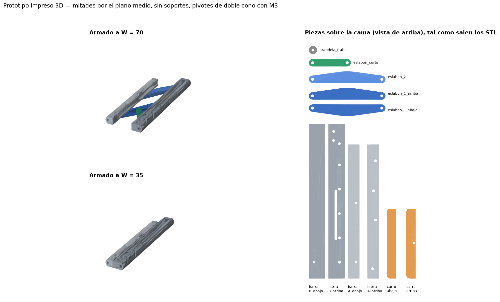
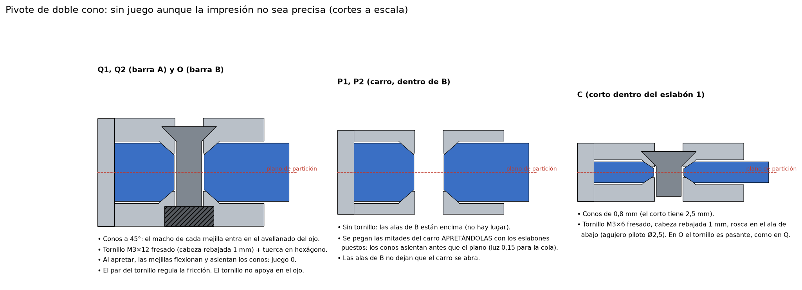

# Prototipo impreso en 3D

Un modelo para **tener en la mano**: sentir cómo trabaja el mecanismo, dónde flexiona y dónde están los puntos críticos. No es el diseño a fabricar. Tiene la misma geometría (190 × 13 mm, ancho de 35 a 105), adaptada a una impresora FDM y a tornillos M3 de cabeza fresada.

Para verlo en 3D (armado con el ancho regulable, despiece y piezas sobre la cama): `visor_prototipo.html`.

Los STL están en `salida/prototipo/`, **ya orientados para imprimir**. Los genera `python prototipo_3d.py`, que además verifica que no haya choques entre piezas de W = 35 a 105. El ensamble a W = 70 está en `salida/prototipo/ensamble_prototipo_W70.step`.

## Cómo se adaptó

- **Mitades por el plano medio.** El diseño es simétrico en el espesor. Por eso las barras A y B, el carro y el eslabón 1 se parten en dos mitades por z = 6,5. Cada mitad se imprime con su **cara exterior sobre la cama** y todos los huecos quedan abiertos hacia arriba: **no hace falta ningún soporte**. Las mitades «arriba» ya vienen dadas vuelta en el STL. El eslabón 2 y el eslabón corto se imprimen enteros, acostados.
- **Articulaciones sin juego: pivote de doble cono.** Cada ojo tiene un avellanado a 45° en las dos caras, y cada mejilla un cono macho que entra en él. El tornillo no apoya en el ojo: solo aprieta. Donde no entra un tornillo (P1, P2 y C), los conos se asientan al pegar las mitades apretándolas. Al ajustarlo, las mejillas flexionan un poco y asientan los conos, así que el juego radial y axial se va a cero aunque la impresión no sea precisa. El par del tornillo regula la fricción. Es el mismo principio de los pasadores expansores y de los pivotes de conos precargados.

- **Más luz que en metal**, porque la impresión no es precisa:
  - 0,45 mm en el plano entre piezas que se mueven;
  - 0,25 mm entre ojos y mejillas, y entre el carro y las alas de B.
- **Simplificado:** sin cable, sin resortes de disco y sin remaches.
- **Traba provisoria por fricción.** Un tornillo M3 pasa por una ranura del ala de arriba de B y rosca en el carro; al apretarlo, el carro queda pinzado contra el ala. No es la traba definitiva (todavía está pendiente). Sirve para cargar el mecanismo.

## Impresión

| | |
|---|---|
| Material | **PETG** (recomendado: más tenaz, avisa antes de romperse) o PLA+ |
| Boquilla / capa | 0,4 mm / 0,2 mm |
| Paredes | 5 perímetros (las mejillas del carro tienen 1,3 mm: quedan macizas) |
| Capas superior/inferior | 5 |
| Relleno | 40 a 50 %, giroide |
| Soportes | **ninguno** |
| Plano de impresión | Todas las piezas con la cara exterior (la de 190 × ancho, o la cara plana de los eslabones) sobre la cama, tal como vienen los STL. Así las cargas del mecanismo, que están en el plano, van a lo largo de los filamentos y no despegan capas. |
| Otros | Compensación de «pata de elefante» activada, o un chaflán de 0,3 mm a mano en el borde de la cama. Brim en las barras si la cama no agarra bien piezas de 190 mm. |

| Pieza (STL) | Cant. | Medidas en la cama |
|---|---:|---|
| `barra_A_abajo`, `barra_A_arriba` | 1 c/u | 14,2 × 165 × 6,5 |
| `barra_B_abajo`, `barra_B_arriba` | 1 c/u | 20 × 190 × 6,5 |
| `carro_abajo`, `carro_arriba` | 1 c/u | 11,4 × 86 × 5 |
| `eslabon_1_abajo`, `eslabon_1_arriba` | 1 c/u | 94 × 14 × 3,5 |
| `eslabon_2` | 1 | 94 × 14 × 7 |
| `eslabon_corto` | 1 | 52 × 9 × 2,5 |
| `arandela_traba` | 1 | Ø10 × 2 |

## Tornillería y otros

| | Cant. | Dónde |
|---|---:|---|
| M3 × 12 cabeza fresada (DIN 7991 / ISO 10642) | 13 | Pivotes Q1, Q2 y O (3) + uniones de las mitades de A (2) y de B (7) + traba (1) |
| Pegamento CA en gel o epoxi de 5 min | – | Mitades del carro y del eslabón 1 |
| Grasa de PTFE o silicona | – | En los conos |

**Sin tuercas: todos los tornillos roscan directo en el plástico.** La mitad de arriba tiene agujero de paso (Ø3,4) y la de abajo un agujero piloto de Ø2,7, donde el tornillo hace su propia rosca. En los pivotes la cabeza queda rebajada 1 mm y la punta al ras de la cara de abajo. En las uniones la cabeza queda al ras y el agujero de abajo es ciego, así que esa cara queda lisa. No hace falta ningún otro largo: en C no va tornillo (un M3 × 8 asomaría 2 mm por abajo del eslabón 1) y los M4 que tenés no se usan. No sobresale ninguna cabeza.

- La primera vez, pasar cada tornillo solo y sacarlo, así forma la rosca sin arrastrar las piezas.
- No apretar de más: en plástico la rosca se barre. Alcanza con que la cabeza asiente.
- Si el piloto salió chico (cuesta mucho), repasarlo con una mecha de 2,5 mm. Si salió grande (el tornillo gira loco), una gota de CA en el agujero y volver a roscar cuando seque.

## Armado (en este orden)

1. **Limpiar.** Repasar los conos con una mecha de 6 mm a mano o un avellanador, sin sacar material, solo rebabas. Engrasar los conos.
2. **C (eslabón 1 + corto).**
   1. Sobre `eslabon_1_abajo` poner el ojo C del corto en su cono.
   2. Poner pegamento en la cara de partición del eslabón 1, lejos de C y de los ojos, y cerrar con `eslabon_1_arriba`.
   3. **Apretar las dos mitades mientras fragua**, como el carro: los conos de C asientan antes que el plano (hay 0,15 mm de luz para la cola), así que el corto queda sin juego. Mover el corto mientras fragua para comprobar que gira.
3. **Carro (P1, P2).** El carro no lleva tornillos de unión: corre entre las alas de B con 0,25 mm de luz, así que no hay lugar para cabezas (las mejillas tienen 1,3 mm y la cabeza fresada 1,65). Sus mitades se pegan, las alas de B no las dejan abrirse, y el tornillo de la traba las atraviesa a las dos.
   1. Sobre `carro_abajo` poner el ojo P1 del eslabón 1 y el ojo P2 del eslabón 2 en sus conos.
   2. Poner pegamento en el lomo y cerrar con `carro_arriba`.
   3. **Apretar las dos mitades con la mano o una pinza mientras fragua.** Los conos asientan antes que el plano (hay 0,15 mm de luz para la cola), así que P1 y P2 quedan sin juego.
4. **B.**
   1. Meter el carro en el riel y apoyar el ojo O del corto en su cono.
   2. Cerrar con `barra_B_arriba`.
   3. Poner los 7 tornillos de unión (repartidos a lo largo de la columna, al lado del riel, cada ~30 mm) y el de O. Sin pegamento: B se puede desarmar.
5. **A.**
   1. Apoyar los ojos Q1 (eslabón 1) y Q2 (eslabón 2) en sus conos.
   2. Cerrar con `barra_A_arriba`.
   3. Poner los 2 tornillos de unión y los de Q1 y Q2. Sin pegamento: A se puede desarmar.
6. **Ajuste.** Apretar cada pivote con tornillo (Q1, Q2 y O) hasta que **no haya juego al torcer y empujar**, pero el mecanismo todavía se mueva con la mano. Si queda duro, aflojar 1/8 de vuelta.
7. **Traba.** Arandela impresa sobre la ranura de B y M3 × 12 hasta el agujero del carro. Se afloja para regular el ancho y se aprieta para cargar.

## Qué esperar y qué mirar

- **Es mucho más débil y más flexible que el metal.**

  | | Metal | Prototipo en PETG |
  |---|---|---|
  | Fluencia | 503 MPa (7075) / 1.170 MPa (17-4PH H900) | ≈ 45 MPa |
  | Módulo | 72 / 197 GPa | ≈ 2 GPa |
  | Carga entre ejes estimada | 733 N a W = 35, 1.307 N a W = 70 | **40 a 70 N a W = 35** y **≈ 90 a 120 N a W = 70** |

  La carga estimada del prototipo es una escala gruesa por material, no un cálculo de la pieza impresa. Se va a deformar entre 30 y 100 veces más.
- **El orden de los puntos débiles no es el mismo que en metal.** En metal los eslabones son de acero y las barras de aluminio. En el prototipo todo es del mismo plástico, así que los eslabones y los ojos se debilitan más que las barras. Lo que el prototipo sí muestra bien es la **geometría**: dónde se concentra la flexión, qué se abre y qué se tuerce.
- **Lo que el análisis anticipa, para mirar:**
  1. **La traba a anchos chicos.** A W = 35 el carro recibe 7,5 veces la carga entre ejes. La traba por fricción va a resbalar primero: es el punto crítico real que falta resolver.
  2. **La barra A** flexionando en la punta del voladizo (lado de y = 165).
  3. **Los ojos del eslabón corto**, en O y en C.
  4. **Las mejillas del carro** en P2.
  5. **El alabeo alrededor del largo (My)**, que es la dirección floja. Torcer el conjunto tomando las dos barras.
- **Si algo se rompe**, mirar si la rotura sigue capas (es un problema de la impresión) o cruza el material (es la geometría). Si no hubiera rotura, conviene filmar la deformación con una regla atrás.

## Para desarmar

A y B se desarman (solo tornillos). El carro y el eslabón 1 quedan pegados. Para cambiar algo se vuelve a imprimir esa pieza, que es barato: el juego completo tiene 66 cm³ de pieza: menos de 85 g de PETG.
