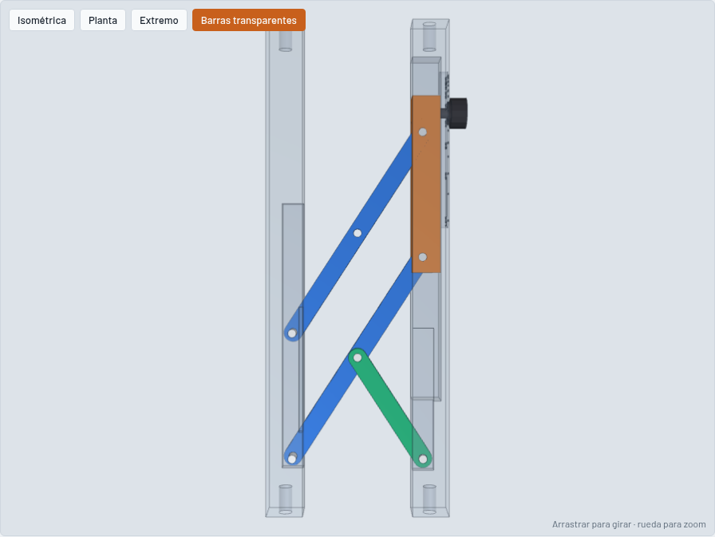

# Eslabón de ancho regulable (doble Scott Russell)

Modelo 3D paramétrico (CadQuery) de un eslabón de **190 × 13 mm** cuyo **ancho se regula a mano entre 35 y 105 mm**.

## Requisitos cumplidos

| Requisito | Cómo se resolvió |
|---|---|
| Largo 190, espesor 13 | Envolvente verificada: X 0…W, Y 0…190, Z 0…13 en todo el recorrido (solo sale la perilla del tornillo de bloqueo, 7 mm hacia afuera de la barra B). |
| Ancho 35…105 regulable | La barra B se traslada en X respecto de la barra A sin girar. |
| 4 agujeros D5 × 10 | Dos por barra, uno en cada cara extrema. Cada par es coaxial, paralelo al largo de 190 y centrado en el espesor (z = 6,5) y en el ancho de la barra. Distancia entre ejes de acople = W − 14. |
| Doble Scott Russell | Paralelogramo de dos eslabones largos (2L = 92) articulados en A (Q1, Q2) y en un carro que corre sobre B (P1, P2). Un eslabón corto (L = 46) une un pivote fijo O de B con el punto medio C del eslabón largo 1. |
| Regulación manual | El carro se desliza en un canal de B y se fija con un tornillo M4 de perilla que pasa por una ranura de la pared exterior. Esa pared lleva una escala grabada de 35 a 105 mm (marca cada 5, número cada 10). |

## Cinemática

- s = W − 20: distancia entre la recta de pivotes de A (Q1, Q2) y la de B (O, P1, P2).
- p = √(92² − s²): posición del carro, distancia O–P1 a lo largo de B.
- O y Q1 están a la misma altura Y (22 mm), así que el eslabón corto OC (con |OC| = L) obliga a Q1 a moverse en una recta perpendicular a B. Ese es el Scott Russell. El paralelogramo mantiene A paralela a B.

| W [mm] | s [mm] | p [mm] | Ángulo de los eslabones largos |
|---:|---:|---:|---:|
| 35 | 15,0 | 90,8 | 80,6° |
| 70 | 50,0 | 77,2 | 57,1° |
| 105 | 85,0 | 35,2 | 22,5° |

El carro recorre 55,6 mm. El script verifica que no haya interferencia entre ningún par de piezas, cada 2,5 mm de ancho, entre 35 y 105.

## Piezas

| Pieza | Cant. | Notas |
|---|---:|---|
| Barra A | 1 | 14 × 190 × 13. Horquilla en la capa de los eslabones largos (z 4…7,5). |
| Barra B | 1 | 14 × 190 × 13. Canal del carro (z 1,5…11,5), horquilla del eslabón corto, ranura y escala. |
| Carro | 1 | 10,8 × 65 × 9,6. Pivotes P1 y P2 separados 48 mm. Agujero roscado M4. |
| Eslabón largo | 2 | 92 entre centros, ancho 7, espesor 3,5, agujero central para C. |
| Eslabón corto | 1 | 46 entre centros, ancho 7, espesor 3 (capa z 8,5…11,5). |
| Perno D3 | 6 | 3 de 13 mm (Q1, Q2, O), 2 de 9,6 mm (P1, P2), 1 de 7,5 mm (C). |
| Separador en C | 1 | D6 × 1. |
| Tornillo M4 con perilla | 1 | Bloqueo del carro. |

## Archivos

| Archivo | Contenido |
|---|---|
| `eslabon.py` | Modelo paramétrico. Todas las cotas están al principio del archivo. |
| `visor.html` | Visor 3D interactivo con control deslizante de ancho (lo genera el script). |
| `visor_plantilla.html` | Plantilla del visor. |
| `salida/ensamble_W35.step`, `_W70`, `_W105` | Ensamble completo en tres posiciones. |
| `salida/piezas/*.step`, `*.stl` | Cada pieza suelta, para CAD o impresión 3D. |
| `img/` | Capturas del visor. |

Para regenerar todo: `pip install cadquery` y después `python eslabon.py`.
