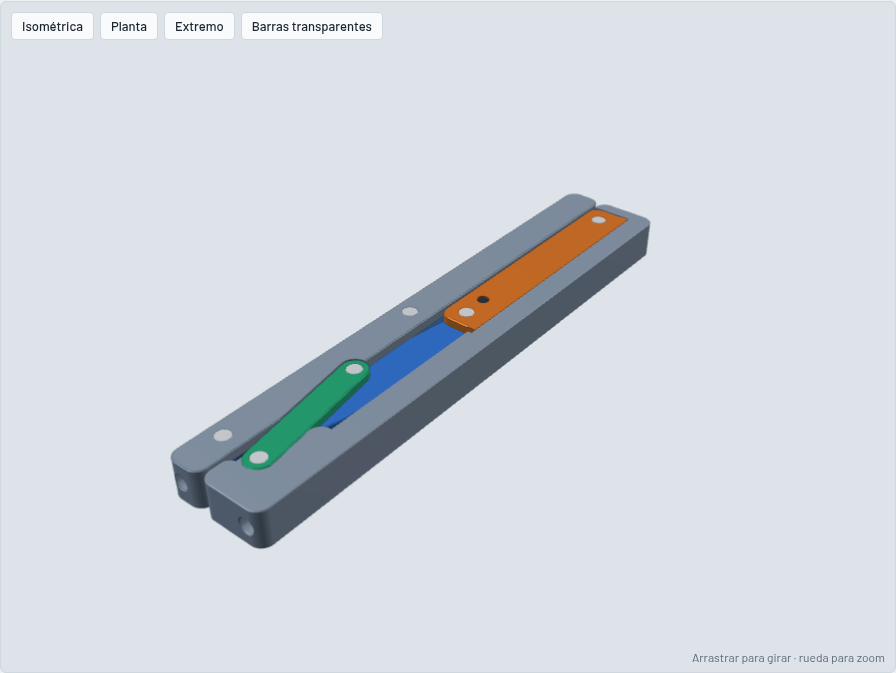
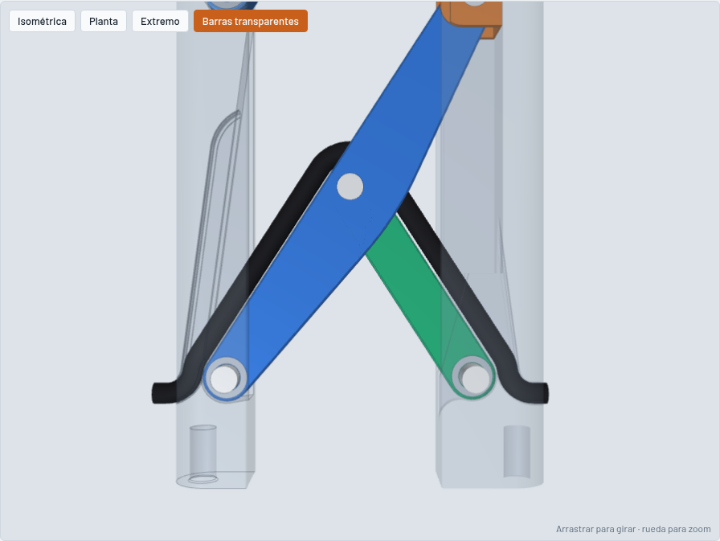

# Eslabón de ancho regulable (doble Scott Russell) — v10

Modelo 3D paramétrico en CadQuery de un eslabón de **190 × 13 mm** (barra B de 190, barra A de 165) cuyo **ancho se regula a mano entre 35 y 105 mm**. Está pensado para mecanizar: barras y carro en **aluminio 7075-T651** anodizado natural granallado (gris claro), eslabones en **acero inoxidable 17-4PH H900 pavonado negro** (óxido negro), con pivotes templados y precargados.

> **Pendiente: la traba del carro.** Esta versión no la incluye. El cálculo supone una traba ideal en el medio del carro (entre P1 y P2) e informa cuánta fuerza tiene que aguantar: 7,5 veces la carga entre ejes a W = 35, 1,6 veces a W = 70 y 0,3 veces a W = 105.

## Cuánto aguanta

Fuerza entre los ejes de acople hasta la primera fluencia, tanto en tracción como en compresión:

| W | 35 | 45 | 50 | 70 | 105 mm |
|---|---:|---:|---:|---:|---:|
| Carga a fluencia | 733 | 1.000 | 1.087 | 1.307 | 1.561 N |
| Carga de trabajo estática (÷ 1,5) | 489 | 666 | 724 | 872 | 1.041 N |
| Flexibilidad entre ejes | 6,7 | 3,0 | 2,4 | 1,4 | 0,7 mm/kN |

Alabeo entre ejes (cupla alrededor del ancho, Mx): rigidez de 57 a 20 N·m/° y capacidad a fluencia de 99 a 27 N·m según el ancho. Alrededor del largo (My) es la dirección floja: de 6,1 a 8,1 N·m/° y 13 N·m a fluencia (rotura estimada ≈ 21 N·m).

Limita la barra A en todo el rango; las seis articulaciones quedan por encima, con margen 1,57 o más a W = 35 (ver «Articulaciones» en el análisis).

El detalle (todas las piezas, hipótesis, torsión y qué cambiar para subirla) está en **[ANALISIS.md](ANALISIS.md)**.

## Diseño

- **Paralelogramo** de dos eslabones largos (85,3 mm entre centros), con pivotes separados 73 mm: Q1 y Q2 en la barra A, P1 y P2 en un carro que corre en la barra B.
- **Eslabón corto** del Scott Russell (42,7 mm, una pieza de 2,5 mm: es una biela, solo trabaja a tracción y compresión): une el pivote O de B con el punto medio C del eslabón 1. Así Q1 se mueve en línea recta perpendicular a B, y la barra A se traslada sin girar.
- **Embocadura en C.** El eslabón corto entra en una ranura central del eslabón 1, que queda con dos alas de 2,15 mm.
- **Riel en C oculto, guiado por las alas.** El carro corre en un canal de B cerrado arriba y abajo por alas de 1,2 mm que trabajan con la columna: la cara ancha es continua y no se ve el carro. Las alas lo guían en z; la columna lo apoya hacia B y un labio de 1,5 × 0,9 mm en el borde interior de cada ala lo retiene hacia A. No hay guía mecanizada en la columna. El canal se abre en la punta de y = 190 para armar y se cierra con una tapa.
- **Eslabones largos iguales, espejados y planos.** Mismo contorno con vientre simétrico en arco (R 60, tangente a los ojos, 9,9 mm de profundidad): el 1 hacia B y el 2 hacia A. Espesor constante de 7 mm.
- **Pivotes Ø5 en doble corte, precargados.** Pasador rectificado a presión en las dos mejillas. En Q1, Q2, O y C es de 17-4PH H1150 y va remachado con punta maciza al ras de las dos caras (avellanado 0,3 × 45°, remachado radial con tope de altura): traba de forma, sin seguros ni piezas que se puedan soltar. En P1 y P2 es templado (ISO 8734) y lo tapan las alas de B. El ojo, de acero templado, se aparea con su pasador (0 a 3 µm: a W = 35 el mecanismo multiplica la holgura por 15). En Q1, Q2, P1 y P2, un resorte de disco 8 × 5,2 × 0,4 empuja el ojo contra la mejilla con ≈ 250 N: no hay juego axial y el ojo no cabecea hasta ≈ 1 N·m por pivote. Regular cuesta unos 10 N. Ver [cortes](img/articulaciones_cortes.png) [justificación](img/articulaciones_justificacion.png) [remachado](img/pasador_remachado.png) y [juego radial](img/pasadores_retencion_juego.png). Estado del arte en ANALISIS.md.
- **Cable Ø4 oculto, de largo fijo.** Entra por el lateral de B, rodea O, sigue el lado de afuera del eslabón corto, pasa por encima de C, baja por el lado de afuera del eslabón 1, rodea Q1 y sale por el lateral de A. En los tres pivotes gira por afuera a R 7: los giros suman siempre 180°, así que el largo es 124,8 mm en todo el recorrido. Dentro de las barras hace curvas fijas de R 5. Los ojos de los eslabones hacen de polea. Ver [el esquema](img/cable_recorrido.png).
- **Lateral exterior en arco R 5** centrado en el eje de acople, de ±25°, con caras planas arriba y abajo y chaflán de 0,5 mm en el encuentro, a todo lo largo de las dos barras; las puntas (caras de 13 × ancho) son planas.
- **Terminación:** bisel de 0,3 mm en las aristas exteriores y agujeros de acople avellanados. Barras, carro y tapa con anodizado natural sobre granallado; eslabones pavonados en negro (óxido negro, acabado estándar del proveedor, 0 a 30 µm: no afecta los ajustes).

## Requisitos

| Requisito | Cómo se resolvió |
|---|---|
| Cable Ø4 de un lado al otro, oculto, largo fijo, R mín 5 | Entra y sale por los laterales de 190 de B y A, a 16,6 mm de la punta (3,4 mm por debajo de O y Q1). Largo 124,8 mm constante. Curvas de R 5 (fijas) y R 7 (en los pivotes). |
| Largo 190, espesor 13 | La envolvente es W × 190 × 13 en todo el recorrido. No sobresale nada. La barra A está acortada a 165 mm del lado del voladizo. |
| Ancho 35 a 105 regulable | La barra B se traslada en X respecto de la barra A, sin girar. |
| 4 agujeros D5 × 10 | Dos por barra, uno en cada cara extrema (en A, en y = 0 y y = 165). Cada par es coaxial, paralelo al largo, centrado en el espesor (z = 6,5) y a 5 mm de la cara exterior de su barra, igual en las dos. Distancia entre ejes: W − 10 (de 25 a 95 mm). |
| Regulación manual | El carro se mueve a mano. **La traba que fija la posición está pendiente.** |

## Piezas

| Pieza | Cant. | Notas |
|---|---:|---|
| Barra A | 1 | 7075-T651. 14,2 × 165 × 13 (acortada 25 mm del lado del voladizo; muesca de 1,4 × 7,2 mm en la esquina interior de la punta), lateral exterior en arco R 5 ±25°. Horquillas en Q1 y Q2, pivotes a 10 mm de la cara exterior. Túnel del cable alrededor de Q1. |
| Barra B | 1 | 7075-T651. 20,0 × 190 × 13, lateral exterior en arco R 5 ±25°. Columna de 8,6 mm y riel en C con alas de 1,2 mm y labios, alojamiento oculto del eslabón corto y túnel del cable en O. |
| Tapa | 1 | Cierra la boca del riel en y = 190; entra como el carro, bajo los labios. |
| Carro | 1 | 7075-T651. 11,4 mm de ancho, 9,8 mm de alto entre las alas, con el escalón de los labios. Horquillas en P1 y P2 (73 mm entre centros), mejillas de 1,6 mm. |
| Eslabón 1 | 1 | **17-4PH H900.** 85,3 mm entre centros, 7 mm de espesor, ojos R 4,5, vientre de 9,9 mm hacia B, embocadura de 2,7 mm en C y túnel del cable alrededor de C. |
| Eslabón 2 | 1 | **17-4PH H900.** Mismo contorno que el 1, espejado: vientre de 9,9 mm hacia A. Sin embocadura. |
| Eslabón corto | 1 | **17-4PH H900.** 42,7 mm entre centros, 2,5 mm de espesor, R 4,5. |
| Pasador Ø5 | 6 | ISO 8734 m6, inoxidable martensítico templado 550 a 650 HV. A presión en las mejillas (H7/m6), el ojo gira con F7/m6. Largos: 13 (Q1, Q2, O), 9,8 (P1, P2), 7 (C). |
| Resorte de disco | 4 | Q1, Q2, P1, P2. 8 × 5,2 × 0,4, h0 0,2, inoxidable para resortes (1.4568), a pedido. Comprimido 0,15 mm: ≈ 250 N. |
| Arandela ondulada | 2 | O y C. Inoxidable para resortes, Ø5,2 × 7,9, 0,25 mm comprimida. |

## Archivos

| Archivo | Contenido |
|---|---|
| `eslabon.py` | Modelo paramétrico. `configurar()` fija la geometría principal y los huecos salen de barrer los eslabones por todo el rango. |
| `analisis.py` | Estática y verificación de cada pieza en tracción y compresión, en todo el recorrido. |
| `secciones.py` | Propiedades de sección medidas sobre los sólidos del CAD. |
| `torsion.py` | Rigidez y resistencia al alabeo entre ejes (fuera del plano), en `salida/torsion.json`. |
| `ajuste_vientres.py` | Busca la profundidad máxima de los vientres de los eslabones largos. |
| `ANALISIS.md` | Informe de resistencia. |
| `visor.html` | Visor 3D con la carga admisible a cada ancho. Lo genera `eslabon.py`. |
| `salida/capacidad.json` | Capacidad por modo de falla cada 2,5 mm de ancho. |
| `salida/ensamble_W35.step`, `ensamble_W70.step`, `ensamble_W105.step` | Ensambles en tres posiciones, con el cable. |
| `salida/piezas/*.step`, `*.stl` | Cada pieza suelta. |

Para regenerar todo: `pip install cadquery shapely` y después `python analisis.py && python eslabon.py`. El script verifica que no haya choques entre piezas, ni entre el cable y las piezas, cada 2,5 mm de ancho.
